# 饥荒联机版专用服务器 · 操作指南

> 📖 **本文写给谁看**：写给**完全没写过代码、没用过 Linux** 的人。你不需要懂编程，只要会"照着敲命令"就能把一台属于自己的饥荒服务器搭起来、管起来。
>
> 🧭 **怎么读**：从头到尾按顺序读一遍，遇到不懂的词先看旁边的"💡 小白翻译"。每一章后面都有命令和图，照着做就行。
>
> 📐 本文大量使用流程图帮助你理解，所有图采用 Mermaid 语法绘制（语法参考：<https://mermaid.js.org/syntax/flowchart.html>）。如果你的阅读器支持 Mermaid，会直接显示成图片。

---

## 目录

1. [前言：什么是饥荒联机版专用服务器](#1-前言什么是饥荒联机版专用服务器)
2. [从零开始：手动搭建服务器（不使用面板）](#2-从零开始手动搭建服务器不使用面板)
3. [服务器目录结构详解](#3-服务器目录结构详解)
4. [存档配置详解（cluster.ini 每个参数）](#4-存档配置详解clusterini-每个参数)
5. [分片配置详解（server.ini 每个参数）](#5-分片配置详解serverini-每个参数)
6. [服务器令牌（cluster_token.txt）](#6-服务器令牌cluster_tokentxt)
7. [服务器启动与停止](#7-服务器启动与停止)
8. [模组的安装、更新与配置](#8-模组的安装更新与配置)
9. [管理员与黑名单](#9-管理员与黑名单)
10. [服务器管理指令（控制台命令）](#10-服务器管理指令控制台命令)
11. [日志与聊天记录](#11-日志与聊天记录)
12. [常见问题与故障排除](#12-常见问题与故障排除)

---

## 1. 前言：什么是饥荒联机版专用服务器

### 1.1 一句话解释

> **专用服务器（Dedicated Server）**，就是一台**只负责跑游戏、不负责玩游戏的电脑**。你和朋友连上去玩，而这台电脑 24 小时开机，世界永远不会停。

### 1.2 为什么要用专用服务器？

你在游戏里点"主持游戏"也能联机，那为什么要大费周章搞专用服务器？请看下面的对比：

| 对比项 | 游戏内开房（点"主持游戏"） | 专用服务器（Dedicated Server） |
|--------|---------------------------|-------------------------------|
| 谁来当"主机" | 你自己的电脑 | 一台专门的服务器 |
| 房主关游戏后 | ❌ 世界关闭，存档暂停 | ✅ 世界继续运行，哪怕没人在玩 |
| 性能 | 房主一边玩一边当主机，会卡 | 服务器专心跑，不卡 |
| 上限人数 | 较少 | 可设几十人 |
| 能否开洞穴（Caves） | 开了容易卡 | 顺畅支持地面 + 洞穴双世界 |
| 需要的技术 | 零 | 需要会一点点 Linux 命令（本文会教） |
| 7×24 小时在线 | ❌（你不开游戏就没有） | ✅ |

> 💡 **小白翻译**：游戏内开房 = "我在家里请客，客人走完我就收拾关灯"。专用服务器 = "我专门租了个场地，24 小时开门，谁来都能玩"。

### 1.3 "开房"和"专用服务器"的关系

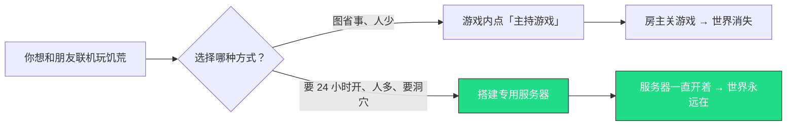

> 📌 **本文只讲专用服务器**的搭建和管理。如果你只是偶尔和两三个朋友玩一两局，用游戏内开房就够了，不需要折腾。

---

## 2. 从零开始：手动搭建服务器（不使用面板）

> 本章假设你有一台**刚买好、什么都没装的 Linux 服务器**（推荐 Debian 或 Ubuntu），并且你已经能用某种工具（比如网页控制台、SSH 工具）连上这台服务器，以 `root`（超级管理员）身份登录。

### 2.1 整体流程总览

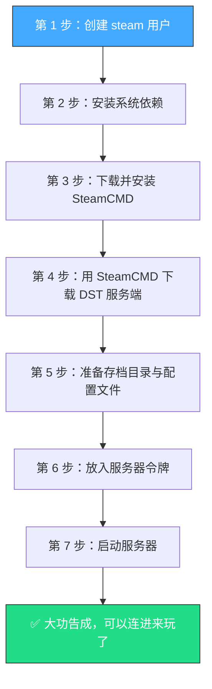

下面逐步讲解。

### 2.2 第 1 步：创建 steam 用户

> 💡 **为什么要单独建一个用户？** 用 `root`（超级管理员）直接跑游戏服务器是有风险的——万一游戏有漏洞，黑客可能借此控制整台机器。建一个权限受限的 `steam` 用户专门跑游戏，就像"让厨师只在厨房活动，不进金库"，更安全。

先以 `root` 身份执行：

```bash
# 创建一个名叫 steam 的用户，主目录在 /home/steam
useradd -m -d /home/steam -s /bin/bash steam

# 给 steam 用户设置一个密码（会让你输两次，输入时屏幕不显示，这是正常的）
passwd steam
```

> 💡 **小白翻译**：`useradd` = "新建一个员工"，`-m` = "顺便给他分一间办公室（主目录）"，`-s /bin/bash` = "让他能用命令行"。

### 2.3 第 2 步：安装系统依赖

DST 服务器需要一些底层的系统库才能运行。以 `root` 身份执行（根据你的系统选一组命令）：

**Debian / Ubuntu（最常见）：**

```bash
apt-get update
apt-get install -y lib32gcc-s1 lib32stdc++6 libcurl-gnutls4 screen
```

**CentOS / Rocky / AlmaLinux：**

```bash
yum install -y glibc.i686 libstdc++.i686 libcurl.i686 screen
```

> 💡 这些库的作用：`lib32...` 是让 64 位系统能跑 32 位程序（SteamCMD 需要），`screen` 是后面用来"让服务器在后台一直跑"的工具。

### 2.4 第 3 步：下载并安装 SteamCMD

> 💡 **SteamCMD 是什么？** 它是 Valve（Steam 的公司）提供的命令行版 Steam。我们不用它来买游戏，而是用它来**下载和更新"专用服务器"程序**。

切换到 `steam` 用户：

```bash
su - steam
```

现在你应该在 `/home/steam` 目录下。下载 SteamCMD：

```bash
# 下载 SteamCMD 的压缩包（如果太慢可以找国内镜像）
wget https://steamcdn-a.akamaihd.net/client/installer/steamcmd_linux.tar.gz

# 解压它（把压缩包里的文件释放出来）
tar -xvzf steamcmd_linux.tar.gz
```

解压后会多出一个 `steamcmd.sh` 文件，这就是 SteamCMD 的启动脚本。验证一下：

```bash
ls -l /home/steam/steamcmd.sh
```

如果看到这个文件，说明安装成功 ✅。

### 2.5 第 4 步：用 SteamCMD 下载 DST 服务端

DST 专用服务器在 Steam 上的编号是 **343050**（这叫 App ID）。执行：

```bash
# 进入 steamcmd 所在目录
cd /home/steam

# 运行 SteamCMD，让它把 DST 服务端下载到 /home/steam/dst_server
./steamcmd.sh \
  +force_install_dir /home/steam/dst_server \
  +login anonymous \
  +app_update 343050 validate \
  +quit
```

逐行解释这些参数的含义：

| 参数 | 含义 |
|------|------|
| `+force_install_dir /home/steam/dst_server` | 把服务端下载到这个目录 |
| `+login anonymous` | 以匿名身份登录（DST 服务端不需要付费账号） |
| `+app_update 343050 validate` | 下载编号 343050 的程序，并校验完整性 |
| `+quit` | 下完了就退出 SteamCMD |

> ⏳ 这一步会下载约 3GB 的文件，请耐心等待。看到 `Success! App '343050' fully installed` 就表示完成了。

> 🔄 **以后要更新服务器**，只需再执行一遍上面这条命令即可，SteamCMD 会自动只下载有变化的部分。

### 2.6 第 5 步：准备存档目录与配置文件

服务端程序下载好了，但它还不知道"开一个什么样的世界"。我们需要创建**存档目录**和**配置文件**。

```bash
# 创建集群存档目录（集群名可以先叫 MyDediServer）
mkdir -p /home/steam/.klei/DoNotStarveTogether/MyDediServer/Master
mkdir -p /home/steam/.klei/DoNotStarveTogether/MyDediServer/Caves
```

然后在对应位置创建三个核心配置文件（后面第 4、5、6 章会详细讲每个参数）：

```
/home/steam/.klei/DoNotStarveTogether/MyDediServer/
├── cluster.ini              ← 集群总配置（第 4 章详解）
├── cluster_token.txt        ← 服务器令牌（第 6 章详解）
├── Master/
│   └── server.ini           ← 地面世界配置（第 5 章详解）
└── Caves/
    └── server.ini           ← 洞穴世界配置（第 5 章详解）
```

### 2.7 第 6 步：放入服务器令牌

这一步非常关键，**没有令牌服务器启动不了**。详细教程见 [第 6 章](#6-服务器令牌cluster_tokentxt)，这里先记住：去游戏里生成一个令牌，粘贴到 `cluster_token.txt` 文件里。

### 2.8 第 7 步：启动服务器

```bash
cd /home/steam/dst_server/bin64

# 启动地面世界
screen -dmS dst_master ./dontstarve_dedicated_server_nullrenderer_x64 -cluster MyDediServer -shard Master

# 启动洞穴世界
screen -dmS dst_caves ./dontstarve_dedicated_server_nullrenderer_x64 -cluster MyDediServer -shard Caves
```

看到这里你可能会问："`screen` 是什么？" 别急，[第 7 章](#7-服务器启动与停止)会详细讲解。

### 2.9 搭建完整流程回顾

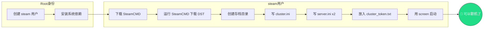

---

## 3. 服务器目录结构详解

服务器安装好之后，文件会分成**两大片区**：一片是"程序本身"，一片是"你的存档和配置"。下面分别讲解。

### 3.1 全景目录树

```
/home/steam/
│
├── steamcmd/                              ← SteamCMD 安装目录（下载工具）
│   ├── steamcmd.sh                        ← SteamCMD 启动脚本
│   ├── linux32/                           ← 32 位运行库
│   └── linux64/                           ← 64 位运行库
│
├── dst_server/                            ← DST 服务端程序目录（SteamCMD 下载的）
│   ├── bin64/                             ← 64 位主程序
│   │   └── dontstarve_dedicated_server_nullrenderer_x64   ← ★ 核心可执行文件
│   ├── bin/                               ← 32 位主程序（一般不用）
│   ├── data/                              ← 游戏资源文件（动画、图片、音效等）
│   ├── mods/                              ← 模组存放目录
│   │   ├── dedicated_server_mods_setup.lua ← ★ 定义"要下载哪些模组"
│   │   ├── workshop-378160973/            ← 已下载的模组（按 Workshop ID 命名）
│   │   └── ...
│   ├── ugc_mods/                          ← 运行时模组链接（自动生成，别手动改）
│   └── version.txt                        ← 服务端版本号
│
└── .klei/                                 ← ★ 你的存档和配置都在这里
    └── DoNotStarveTogether/
        └── MyDediServer/                  ← 一个"集群"（=一个房间）
            ├── cluster.ini                ← ★ 集群总配置
            ├── cluster_token.txt          ← ★ 服务器令牌
            ├── adminlist.txt              ← ★ 管理员名单
            ├── blocklist.txt              ← ★ 黑名单
            ├── Master/                    ← 地面世界（分片）
            │   ├── server.ini             ← ★ 地面配置
            │   ├── modoverrides.lua       ← ★ 地面模组开关与配置
            │   ├── server_log.txt         ← 地面日志
            │   ├── server_chat_log.txt    ← 地面聊天记录
            │   ├── save/                  ← 地面存档数据
            │   └── backup/                ← 旧日志归档
            └── Caves/                     ← 洞穴世界（分片）
                ├── server.ini             ← ★ 洞穴配置
                ├── modoverrides.lua       ← ★ 洞穴模组开关与配置
                ├── server_log.txt         ← 洞穴日志
                ├── server_chat_log.txt    ← 洞穴聊天记录
                ├── save/                  ← 洞穴存档数据
                └── backup/                ← 旧日志归档
```

> ⭐ 带 ★ 的是你**经常需要打交道**的文件，其余的可以不管。

### 3.2 程序目录（dst_server/）详解

下面用 ER 图（实体关系图）展示程序目录里各文件夹之间的关系和作用：

```mermaid
erDiagram
    DST_SERVER ||--|| BIN64 : "包含"
    DST_SERVER ||--|| DATA : "包含"
    DST_SERVER ||--|| MODS : "包含"
    DST_SERVER ||--o| UGC_MODS : "包含"

    BIN64 {
        string 作用 "核心可执行文件"
        string 文件 dontstarve_dedicated_server_nullrenderer_x64
        string 说明 "服务器的「大脑」，所有运算都在这里"
    }
    DATA {
        string 作用 "游戏资源仓库"
        string 子目录 anim "角色/物品的动画文件"
        string 子目录 bigportraits "大头像立绘"
        string 子目录 databundles "打包好的资源包"
        string 子目录 images "贴图图片"
        string 子目录 sound "音效与音乐"
        string 子目录 levels "世界生成的预设规则"
        string 说明 "这些文件是游戏自带的，不要动"
    }
    MODS {
        string 作用 "模组仓库"
        string 文件 dedicated_server_mods_setup_lua "声明要下载哪些模组"
        string 文件夹 workshop-数字 "每个模组一个文件夹"
        string 说明 "你装的模组都放在这里"
    }
    UGC_MODS {
        string 作用 "运行时模组链接"
        string 结构 按集群和分片组织 "MyDediServer/Master/content 等"
        string 说明 "服务器自动生成，不要手动修改"
    }
```

**各文件夹的通俗解释：**

| 目录 | 通俗比喻 | 你需要动它吗？ |
|------|---------|---------------|
| `bin64/` | 饭店的**厨房**（真正干活的地方） | 不用动，只用来启动 |
| `data/anim/` | 菜的**照片**（角色和物品怎么动） | 不用动 |
| `data/bigportraits/` | 角色的**证件照**（大头像） | 不用动 |
| `data/databundles/` | 打包好的**食材包**（贴图、字体等打捆存放） | 不用动 |
| `data/images/` | 菜单上的**图片** | 不用动 |
| `data/sound/` | 饭店的**背景音乐** | 不用动 |
| `data/levels/` | **菜谱规则**（世界怎么生成） | 不用动 |
| `mods/` | **插件货架**（模组存放处） | 偶尔改（第 8 章） |
| `ugc_mods/` | **上菜窗口**（运行时自动调配模组） | ❌ 绝对不要手动改 |

### 3.3 存档目录（.klei/）详解

你的**配置文件、存档数据、日志**全在 `.klei` 目录下。这是你最常打交道的地方。

> 💡 **小白翻译**：`dst_server/` 像是"游戏光盘"（程序本体），`.klei/` 像是"你的存档卡"（你的世界、你的设置）。重装程序不会丢存档，删 `.klei` 才会丢存档。

---

## 4. 存档配置详解（cluster.ini 每个参数）

`cluster.ini` 是**集群总配置文件**，它决定了整个服务器（包括地面和洞穴）的"大方向"设定。一个典型的 `cluster.ini` 长这样：

```ini
[GAMEPLAY]
game_mode = survival
max_players = 6
pvp = false
pause_when_empty = false
intention = cooperative
vote_kick_enabled = false

[NETWORK]
cluster_name = My DST Server
cluster_description = A dedicated server for friends
cluster_password =

[MISC]
console_enabled = true

[SHARD]
shard_enabled = true
bind_ip = 127.0.0.1
master_ip = 127.0.0.1
master_port = 10889
cluster_key = supersecretkey
```

> 📍 文件位置：`/home/steam/.klei/DoNotStarveTogether/MyDediServer/cluster.ini`

> 💡 **什么是 `.ini` 文件？** 它是一种配置文件格式，用方括号 `[xxx]` 分成几个"段落"，每个段落下面写 `参数名 = 值`。就像一份表格，每一行设定一件事。

下面逐段逐参数讲解。

### 4.1 [GAMEPLAY] 游戏玩法段

这一段控制"游戏怎么玩"。

| 参数 | 可选值 | 说明 | 改了会怎样 |
|------|--------|------|-----------|
| `game_mode` | `survival` / `endless` / `wilderness` | 游戏模式（见下方详解） | 改了需要**重新生成世界**才生效 |
| `max_players` | 数字，如 `6`、`16` | 同时在线最多多少人 | 改完重启服务器即生效 |
| `pvp` | `true` / `false` | 玩家之间能否互相攻击 | `true` = 可以互相打；改完重启生效 |
| `pause_when_empty` | `true` / `false` | 没人的时候是否暂停世界 | **建议 `false`**，详见下方 |
| `intention` | `cooperative` / `competitive` / `madness` / `social` | 服务器"风格标签"（只影响筛选分类） | 不影响实际玩法，只影响大厅里如何分类展示 |
| `vote_kick_enabled` | `true` / `false` | 是否允许玩家投票踢人 | `true` = 玩家可投票把捣乱者踢出去 |

#### 🔍 三种游戏模式有什么区别？

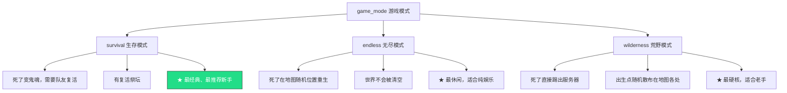

> 💡 **小白选哪个？** 第一次开服务器，选 **`survival`** 最经典最稳妥。

#### ⚠️ pause_when_empty 为什么建议设为 false？

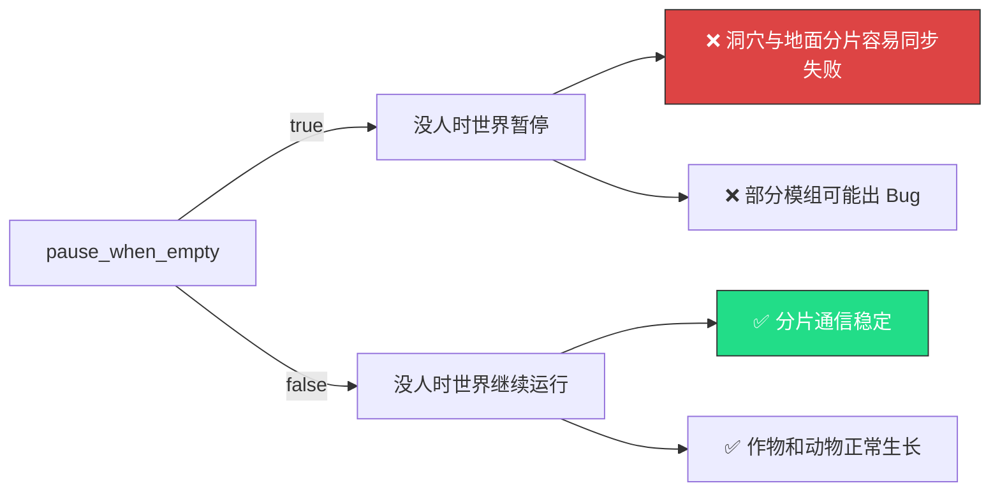

> 📌 如果你开了洞穴（Caves），`pause_when_empty` **必须**设为 `false`，否则洞穴和地面之间的通信会出问题。

#### 🔍 intention 四种风格

| 值 | 中文 | 含义 |
|----|------|------|
| `cooperative` | 合作 | 标签显示为"合作"，鼓励大家一起生存 |
| `competitive` | 竞技 | 标签显示为"竞技"，鼓励竞争 |
| `madness` | 疯狂 | 标签显示为"疯狂"，适合高难度 |
| `social` | 社交 | 标签显示为"社交"，适合休闲聊天 |

> 这个参数**只影响服务器在游戏大厅里的分类标签**，不会改变任何实际玩法。

### 4.2 [NETWORK] 网络段

这一段控制"服务器对外怎么展示"。

| 参数 | 说明 | 例子 | 改了会怎样 |
|------|------|------|-----------|
| `cluster_name` | 服务器名称（玩家在大厅看到的名字） | `和朋友一起玩` | 改完重启生效 |
| `cluster_description` | 服务器描述（显示在名称下方） | `欢迎来玩！` | 改完重启生效 |
| `cluster_password` | 服务器密码（留空 = 不要密码） | `mypassword123` | 改完重启生效；留空则任何人都能进 |
| `cluster_language` | 服务器语言（用于大厅筛选，如 `chinese`） | `chinese` | 改完重启生效 |

> 💡 **小白翻译**：
> - `cluster_name` = 你店门口的**招牌**
> - `cluster_description` = 招牌下面的**一句话介绍**
> - `cluster_password` = 进门的**门禁卡密码**（不设就是敞开大门）

> ⚠️ `cluster_name` 不要起得太长（建议 20 个字以内），否则有些客户端显示不全。**不要用特殊符号**，可能引起乱码。

### 4.3 [MISC] 杂项段

| 参数 | 说明 | 推荐值 | 改了会怎样 |
|------|------|--------|-----------|
| `console_enabled` | 是否允许在服务器端使用控制台（输入指令） | `true` | `false` = 无法输入管理命令，**强烈建议 `true`** |

> 📌 这个一定要设为 `true`，否则你连 `c_save()`（存档）这种命令都用不了。

### 4.4 [SHARD] 分片段

这一段控制"地面世界和洞穴世界如何互相通信"。详见 [第 5 章](#5-分片配置详解serverini-每个参数)。

| 参数 | 说明 | 典型值 | 改了会怎样 |
|------|------|--------|-----------|
| `shard_enabled` | 是否启用分片（多世界联动） | `true` | `false` = 只有地面，没有洞穴 |
| `bind_ip` | 地面世界监听的地址 | `127.0.0.1` | 用 `127.0.0.1`（本机）即可 |
| `master_ip` | 洞穴要连接的地面地址 | `127.0.0.1` | 地面洞穴在同一台机器上就用 `127.0.0.1` |
| `master_port` | 分片之间通信的端口 | `10889` | 地面和洞穴必须一致 |
| `cluster_key` | 分片之间的"暗号" | `supersecretkey` | **地面和洞穴必须完全一致**，否则连不上 |

> ⚠️ `cluster_key` 就像是地面和洞穴之间的**接头暗号**，两边必须说同一句暗号才能对上话。如果你忘了改其中一边，洞穴就永远连不上地面。

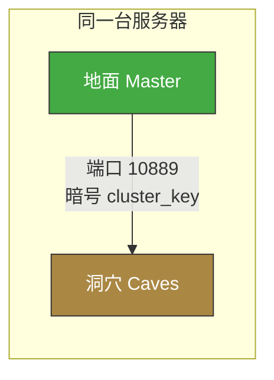

---

## 5. 分片配置详解（server.ini 每个参数）

**每个分片（地面 Master、洞穴 Caves）都有自己独立的 `server.ini`**，它定义了"这个分片用哪些端口、扮演什么角色"。

> 📍 文件位置：
> - 地面：`/home/steam/.klei/DoNotStarveTogether/MyDediServer/Master/server.ini`
> - 洞穴：`/home/steam/.klei/DoNotStarveTogether/MyDediServer/Caves/server.ini`

### 5.1 地面世界 server.ini（Master）

```ini
[NETWORK]
server_port = 11000

[SHARD]
is_master = true

[STEAM]
master_server_port = 27018
authentication_port = 8768

[ACCOUNT]
encode_user_path = true
```

### 5.2 洞穴世界 server.ini（Caves）

```ini
[NETWORK]
server_port = 11001

[SHARD]
is_master = false
name = Caves
id = 3443857223

[STEAM]
master_server_port = 27019
authentication_port = 8769

[ACCOUNT]
encode_user_path = true
```

### 5.3 每个参数详解

#### [NETWORK] 段

| 参数 | 说明 | 地面值 | 洞穴值 | 改了会怎样 |
|------|------|--------|--------|-----------|
| `server_port` | 这个分片的**游戏端口**，玩家通过它连接 | `11000` | `11001` | 地面和洞穴必须**不同**；改了要同步改防火墙 |

> 💡 `server_port` 就像是**两扇不同的门**，玩家进地面走 11000 号门，进洞穴走 11001 号门。两扇门不能同号，否则会撞车。

#### [SHARD] 段

| 参数 | 说明 | 地面值 | 洞穴值 | 改了会怎样 |
|------|------|--------|--------|-----------|
| `is_master` | 这个分片是不是"主世界（地面）" | `true` | `false` | **必须有且只有一个**设为 `true` |
| `name` | 分片的名字 | （可不填） | `Caves` | 洞穴分片建议填 `Caves` |
| `id` | 分片的唯一编号 | （可不填） | 随机数字 | 多个洞穴时每个要用不同的 ID |

> 💡 `is_master` 就像是在说"我是老大（地面）"还是"我是小弟（洞穴）"。一个集群里**只能有一个老大**。

#### [STEAM] 段

| 参数 | 说明 | 地面值 | 洞穴值 | 改了会怎样 |
|------|------|--------|--------|-----------|
| `master_server_port` | Steam 主服务器端口 | `27018` | `27019` | 地面和洞穴必须**不同** |
| `authentication_port` | Steam 认证端口 | `8768` | `8769` | 地面和洞穴必须**不同** |

> 💡 这两个端口是给 Steam 平台用的（玩家身份验证、服务器列表注册），不用深入理解，**地面和洞穴设成不同的值就行**。

#### [ACCOUNT] 段

| 参数 | 说明 | 推荐值 | 改了会怎样 |
|------|------|--------|-----------|
| `encode_user_path` | 是否对用户数据路径编码 | `true` | 保持 `true` 即可，无需修改 |

### 5.4 端口映射全景图

这是最容易搞混的部分，用一张流程图把所有端口的关系画清楚：

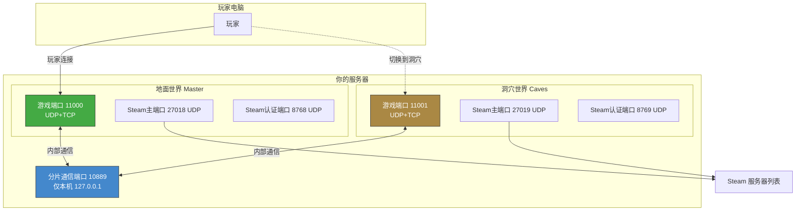

### 5.5 需要对外开放的端口清单

如果你设置了防火墙或云服务器安全组，以下端口**必须对外开放**，否则玩家连不进来：

| 端口 | 协议 | 用途 | 必须开放？ |
|------|------|------|-----------|
| `11000` | UDP + TCP | 地面世界游戏端口 | ✅ 是 |
| `11001` | UDP + TCP | 洞穴世界游戏端口 | ✅ 是 |
| `27018` | UDP | 地面 Steam 主端口 | ✅ 是 |
| `27019` | UDP | 洞穴 Steam 主端口 | ✅ 是 |
| `8768` | UDP | 地面 Steam 认证端口 | ✅ 是 |
| `8769` | UDP | 洞穴 Steam 认证端口 | ✅ 是 |
| `10889` | TCP | 分片内部通信 | ❌ 否（仅 127.0.0.1） |

> 💡 **最省心的做法**：把上面所有 UDP 和 TCP 端口全部放行。很多云服务商（阿里云、腾讯云）需要同时设置**系统防火墙**和**控制台安全组**两道关卡，缺一不可。

---

## 6. 服务器令牌（cluster_token.txt）

### 6.1 什么是令牌？为什么需要它？

> 💡 **令牌（Token）**就像是你开店的**营业执照**。没有营业执照（令牌），Klei 的服务器大厅不认你的服务器，你的服务器就无法出现在公开列表里，玩家也连不进来。

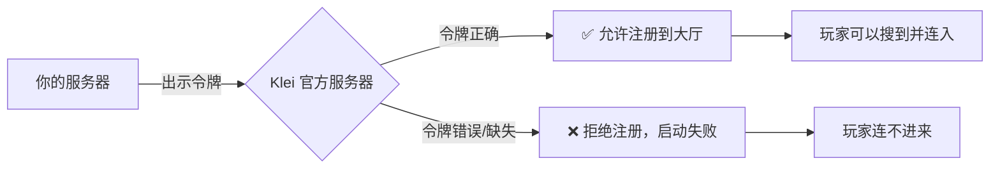

### 6.2 怎么获取令牌？

令牌要从**你自己的饥荒游戏**里生成，步骤如下：

1. 打开饥荒联机版游戏（不是服务器，是你电脑上玩的那款）。
2. 在主菜单界面，按 `~` 键（键盘左上角，数字 1 左边那个键）打开控制台。
3. 输入以下命令并回车：

   ```lua
   TheNet:GenerateClusterToken()
   ```

4. 这会在你的电脑上生成一个令牌文件。文件位置：
   - **Windows**：`C:\Program Files (x86)\Steam\steamapps\common\Don't Starve Together\client_save\cluster_token.txt`
   - **Mac**：`~/Library/Application Support/Steam/steamapps/common/Don't Starve Together/client_save/cluster_token.txt`

5. 用记事本打开这个文件，**复制里面的全部内容**。

### 6.3 把令牌放到服务器上

令牌文件的位置（**和 cluster.ini 在同一个目录**）：

```
/home/steam/.klei/DoNotStarveTogether/MyDediServer/cluster_token.txt
```

把复制的内容粘贴进去，保存。令牌的格式大概长这样：

```
pds-g^KU_xxxxxxxx^一长串乱码字符..........
```

> ⚠️ **令牌就是你的服务器身份证**，不要泄露给别人。别人拿到你的令牌，可以冒充你的服务器。

### 6.4 没有令牌会怎样？

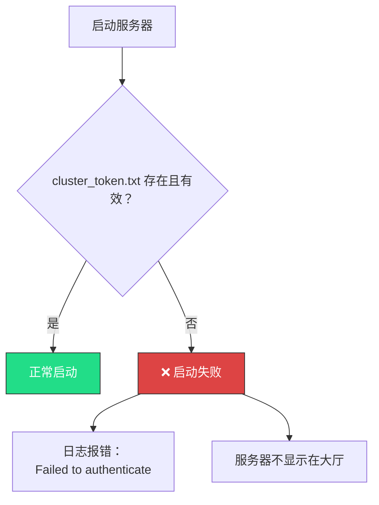

> 📌 如果服务器启动后玩家连不进来，**第一个要检查的就是令牌**。

---

## 7. 服务器启动与停止

### 7.1 什么是 screen？为什么需要它？

> 💡 **screen** 是 Linux 的一个工具，它可以创建"虚拟终端窗口"。你可以把它想象成**一台可以一直开着的隐形显示器**——就算你关掉自己的 SSH 连接，服务器在那台"隐形显示器"上照样跑。

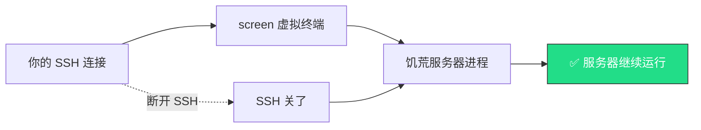

如果没有 screen，你一关 SSH，服务器进程就会被杀掉，世界就没了。

### 7.2 启动服务器

**核心命令（手动启动）：**

```bash
# 切换到 steam 用户
su - steam

# 进入可执行文件目录
cd /home/steam/dst_server/bin64

# 启动地面世界（Master）
screen -dmS dst_master ./dontstarve_dedicated_server_nullrenderer_x64 -cluster MyDediServer -shard Master

# 启动洞穴世界（Caves）
screen -dmS dst_caves ./dontstarve_dedicated_server_nullrenderer_x64 -cluster MyDediServer -shard Caves
```

**命令参数详解：**

| 参数 | 含义 |
|------|------|
| `screen -dmS dst_master` | 创建一个名叫 `dst_master` 的后台虚拟终端 |
| `./dontstarve_dedicated_server_nullrenderer_x64` | 运行 DST 服务器主程序（`nullrenderer` = 不渲染画面，因为服务器不需要显示画面） |
| `-cluster MyDediServer` | 使用名为 `MyDediServer` 的集群存档 |
| `-shard Master` | 运行地面分片（Master） |
| `-shard Caves` | 运行洞穴分片（Caves） |
| `-offline` | （可选）离线模式，不连接 Klei 官方服务器，**不在公开列表显示**，适合纯局域网或测试 |

> 💡 **`-offline` 加不加的区别**：不加 = 服务器会出现在游戏大厅公开列表里，全世界都能搜到；加了 = 只有知道 IP 的人能直连，不会出现在列表里。

#### 启动流程时序图

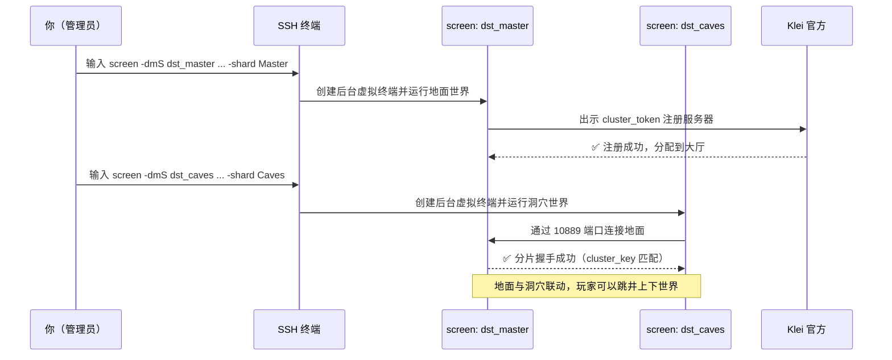

### 7.3 停止服务器

**优雅停止（推荐）：**

先进入对应的 screen 会话（见 7.4），输入：

```lua
c_shutdown()
```

服务器会先保存世界，然后安全退出。

**强制停止（如果卡住了）：**

```bash
screen -S dst_master -X quit
screen -S dst_caves -X quit
```

> ⚠️ 强制停止可能丢失未保存的进度。**优先用 `c_shutdown()`**。

### 7.4 进入（attach）和退出（detach）screen 会话

**查看有哪些 screen 会话在运行：**

```bash
screen -ls
```

**进入地面世界的控制台：**

```bash
screen -r dst_master
```

**从 screen 中退出来（但不关闭服务器）：**

按住 `Ctrl`，然后依次按 `A`、`D`（即 `Ctrl+A` 然后 `D`）。

> 💡 **小白翻译**：`screen -r` = "走进那个房间"；`Ctrl+A, D` = "走出房间但让里面的灯继续亮着"。

> ⚠️ **千万不要按 `Ctrl+C` 来退出！** 那样会直接杀掉服务器进程。一定要用 `Ctrl+A, D`。

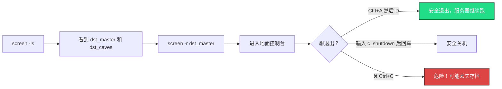

### 7.5 快捷脚本

你的服务器上可能已经有现成的启动/停止脚本，直接用就行：

```bash
# 启动
/home/steam/start_dst.sh

# 停止
/home/steam/stop_dst.sh

# 更新服务端
/home/steam/update_dst.sh
```

---

## 8. 模组的安装、更新与配置

### 8.1 两层模组系统（最重要！）

DST 服务器的模组管理分**两层**，很多人在这里栽跟头。请务必理解：

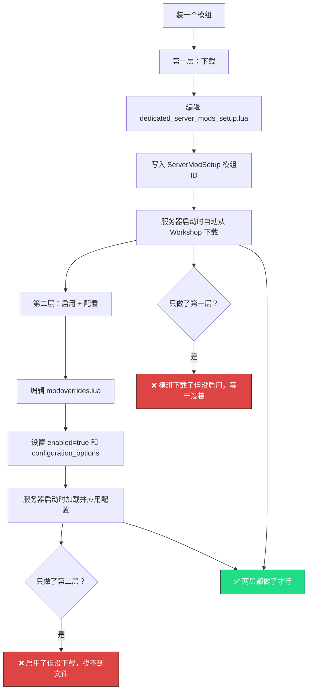

| 层次 | 文件 | 作用 | 类比 |
|------|------|------|------|
| **第一层：下载** | `dedicated_server_mods_setup.lua` | 声明"要下载哪些模组" | **去商店把东西买回家** |
| **第二层：启用** | `modoverrides.lua`（每个分片各一份） | 声明"启用哪些模组、怎么配置" | **把买回家的东西拆包装、通电使用** |

> ⚠️ **两层缺一不可**。只下载不启用 = 白下载；只启用没下载 = 找不到文件报错。

### 8.2 第一层：下载模组

> 📍 文件位置：`/home/steam/dst_server/mods/dedicated_server_mods_setup.lua`

打开这个文件，在里面添加一行：

```lua
ServerModSetup("378160973")
```

- `378160973` 是模组在 Steam Workshop 上的 ID（下面教你怎么找）。
- 每行一个模组，想装几个就写几行。

服务器**每次启动**时都会检查这些模组是否有更新，有就自动下载。

> 💡 还有一个批量下载的命令 `ServerModCollectionSetup("ID")`，用于一次性下载整个模组合集（Collection），但不常用。

### 8.3 第二层：启用和配置模组

> 📍 文件位置（**每个分片各一份，都要改**）：
> - 地面：`/home/steam/.klei/DoNotStarveTogether/MyDediServer/Master/modoverrides.lua`
> - 洞穴：`/home/steam/.klei/DoNotStarveTogether/MyDediServer/Caves/modoverrides.lua`

格式如下：

```lua
return {
    ["workshop-378160973"] = {      -- 注意前缀 workshop- + 模组ID
        enabled = true,             -- true=启用，false=禁用
        configuration_options = {   -- 模组的配置项（可选）
            -- 这里的选项因模组而异，看模组文档
        },
    },
}
```

> ⚠️ **地面的 `modoverrides.lua` 和洞穴的 `modoverrides.lua` 内容必须保持一致**（绝大多数情况下），否则地面和洞穴的行为会不一致，导致各种奇怪 Bug。

### 8.4 如何找到模组的 Workshop ID？

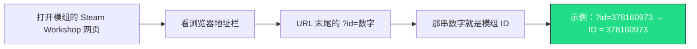

**具体步骤：**

1. 打开 <https://steamcommunity.com/app/322330/workshop/>（DST 的 Workshop 页面）。
2. 找到你想装的模组，点进去。
3. 看浏览器地址栏，比如：
   ```
   https://steamcommunity.com/sharedfiles/filedetails/?id=378160973
   ```
4. `id=` 后面的数字 **`378160973`** 就是这个模组的 ID。

### 8.5 modinfo.lua 关键字段

每个模组文件夹里都有一个 `modinfo.lua`，它描述了这个模组的信息。作为服务器管理员，你只需要了解以下几个字段：

| 字段 | 含义 | 服务器管理者需要关心吗？ |
|------|------|------------------------|
| `name` | 模组名称 | 用来识别是哪个模组 |
| `version` | 模组版本号 | 排查问题时看版本是否过时 |
| `all_clients_require_mod` | 是否所有玩家都必须装这个模组 | `true` = 不装的玩家进不来 |
| `client_only_mod` | 是否是纯客户端模组（服务器不需要） | `true` 的模组服务器不用装 |
| `configuration_options` | 模组可配置的选项列表 | 决定你在 `modoverrides.lua` 里能写什么 |

> 💡 重点关注 `all_clients_require_mod`：
> - 设为 `true`：这种模组会影响游戏核心逻辑（比如新增角色），**所有连进来的玩家都必须订阅并安装它**，否则无法进入。
> - 设为 `false`：这种模组只在服务器端运行（比如显示信息），玩家不需要装也能玩。

### 8.6 完整示例：启用 Global Positions（全球定位）模组

Global Positions 的 Workshop ID 是 **378160973**，它可以在地图上显示队友位置。

**第一步：下载（编辑 dedicated_server_mods_setup.lua）**

```lua
-- /home/steam/dst_server/mods/dedicated_server_mods_setup.lua
ServerModSetup("378160973")
```

**第二步：启用（编辑 modoverrides.lua，地面和洞穴都要改）**

```lua
-- /home/steam/.klei/DoNotStarveTogether/MyDediServer/Master/modoverrides.lua
-- /home/steam/.klei/DoNotStarveTogether/MyDediServer/Caves/modoverrides.lua
return {
    ["workshop-378160973"] = {
        enabled = true,
        configuration_options = {
            -- Global Positions 的配置项
            -- 具体有哪些选项，看模组的 Workshop 页面说明
        },
    },
}
```

**第三步：重启服务器**

```bash
# 进入地面控制台
screen -r dst_master
# 输入（会保存并关闭）
c_shutdown()

# 同样关闭洞穴
screen -r dst_caves
c_shutdown()

# 重新启动
cd /home/steam/dst_server/bin64
screen -dmS dst_master ./dontstarve_dedicated_server_nullrenderer_x64 -cluster MyDediServer -shard Master
screen -dmS dst_caves ./dontstarve_dedicated_server_nullrenderer_x64 -cluster MyDediServer -shard Caves
```

**完整流程图：**

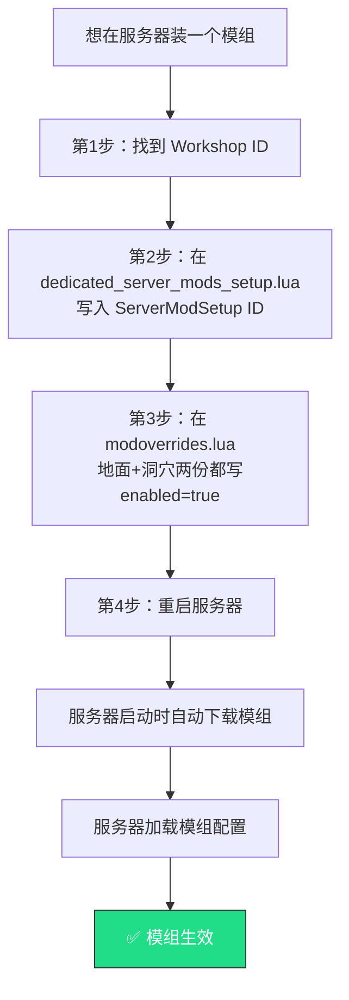

---

## 9. 管理员与黑名单

### 9.1 管理员（adminlist.txt）

> 📍 文件位置：`/home/steam/.klei/DoNotStarveTogether/MyDediServer/adminlist.txt`

**怎么加管理员：** 把玩家的 KU_id 写入 `adminlist.txt`，**一行一个**：

```
KU_cZLtq95O
KU_xxx另一个人的ID
```

> 💡 **什么是 KU_id？** 它是每个 Klei 账号的唯一编号，格式是 `KU_` 开头加一串字母数字。就像每个人的身份证号。

### 9.2 黑名单（blocklist.txt）

> 📍 文件位置：`/home/steam/.klei/DoNotStarveTogether/MyDediServer/blocklist.txt`

**怎么封禁玩家：** 把玩家的 KU_id 写入 `blocklist.txt`，**一行一个**：

```
KU_捣乱分子的ID
```

### 9.3 管理员和封禁什么时候生效？

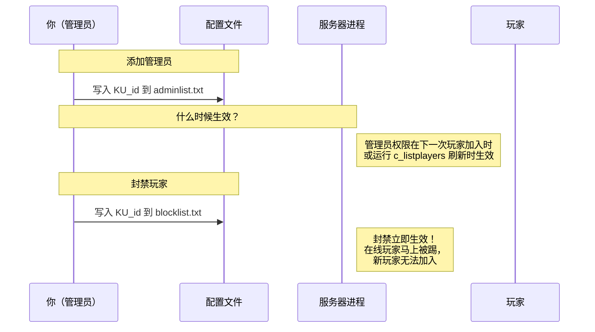

| 操作 | 文件 | 生效时机 |
|------|------|---------|
| 添加管理员 | `adminlist.txt` | **下一次有玩家加入时**或**你手动执行 `c_listplayers()` 刷新时**生效。如果想立即生效，重启服务器最保险。 |
| 封禁玩家 | `blocklist.txt` | **立即生效**。如果目标在线，会被立刻踢出；新加入也会被拦截。 |

> 📌 也可以不写文件，直接用控制台命令封禁/解封（见 [第 10 章](#10-服务器管理指令控制台命令)）：
> ```lua
> TheNet:Ban("KU_xxx")     -- 封禁
> TheNet:Unban("KU_xxx")   -- 解封
> ```

### 9.4 怎么找到玩家的 KU_id？

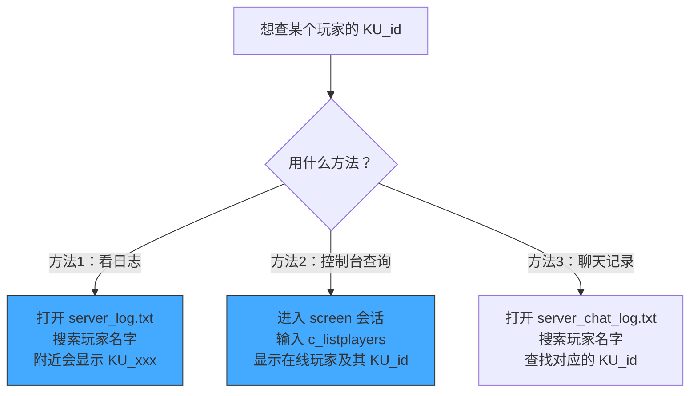

**方法 2 的控制台命令：**

```lua
c_listplayers()
```

输出大概长这样：

```
[1] 玩家名字 (KU_xxxxxxxx) ...
[2] 另一个玩家 (KU_yyyyyyyy) ...
```

括号里的 `KU_xxxxxxxx` 就是你要的 KU_id。

---

## 10. 服务器管理指令（控制台命令）

> 📌 所有命令都在**screen 会话内**输入（先 `screen -r dst_master` 进入地面控制台）。输入完按回车执行。

### 10.1 服务器管理类

| 命令 | 作用 | 说明 |
|------|------|------|
| `c_save()` | 立即保存世界 | ⭐ 最常用，做完重要操作后建议手动存一下 |
| `c_rollback(N)` | 回滚 N 天 | 如 `c_rollback(1)` 回到昨天；N 最大一般为 5（取决于存档设置） |
| `c_regenerateworld()` | 重新生成世界 | ⚠️ 会清除当前世界！慎用 |
| `c_announce("文字")` | 全服广播公告 | 所有玩家屏幕中央会显示这句话，如 `c_announce("5分钟后维护")` |
| `c_shutdown()` | 安全关机 | 先保存再关闭，**推荐用这个关服务器** |
| `c_listplayers()` | 列出在线玩家 | 显示编号、名字、KU_id |
| `TheNet:Ban("KU_xxx")` | 封禁指定玩家 | 立即踢出并加入黑名单 |
| `TheNet:Unban("KU_xxx")` | 解封指定玩家 | 从黑名单移除 |
| `c_listallplayers()` | 列出所有曾加入的玩家 | 包括已离线的 |

> 💡 **小白翻译**：
> - `c_save()` = **"Ctrl+S 存档"**
> - `c_rollback(1)` = **"后悔药，回到昨天"**
> - `c_shutdown()` = **"安全关机"**（不是拔电源）
> - `c_announce("xxx")` = **"大喇叭喊话"**

### 10.2 物品与生成类

| 命令 | 作用 | 例子 |
|------|------|------|
| `c_spawn("prefab", 数量)` | 在鼠标位置生成物品/生物 | `c_spawn("axe", 1)` 在鼠标处生成一把斧头 |
| `c_give("prefab", 数量)` | 把物品直接放进自己背包 | `c_give("log", 10)` 给自己 10 个木头 |
| `c_spawn("deerclops")` | 生成一个 BOSS | 在鼠标位置召唤独眼巨鹿 |

> 💡 **什么是 prefab？** 它是"预制件"的缩写，就是游戏里每样东西的内部代号。比如 `axe` = 斧头，`log` = 木头，`flint` = 燧石，`goldnugget` = 金块。具体代号可以在网上搜"DST prefab list"。

### 10.3 玩家定位类

| 命令 | 作用 | 例子 |
|------|------|------|
| `UserToPlayer("KU_xxx")` | 根据 KU_id 获取玩家对象 | 通常配合下面的命令使用 |
| `c_goto(UserToPlayer("KU_xxx"))` | 传送到指定玩家身边 | 把你传到那个玩家旁边 |
| `c_despawn(UserToPlayer("KU_xxx"))` | 让指定玩家变成观察者（鬼魂） | 用于把捣乱者踢出角色 |

### 10.4 世界操控类

这些命令通过 `TheWorld:PushEvent("事件名", 参数)` 来操控世界：

| 命令 | 作用 | 例子 |
|------|------|------|
| `TheWorld:PushEvent("ms_setseason", "winter")` | 强制切换季节 | 切换到冬天（`winter`）。其他：`summer`/`autumn`/`spring` |
| `TheWorld:PushEvent("ms_nextphase")` | 快进到下一个时间段 | 白天→黄昏→夜晚→白天 |
| `TheWorld:PushEvent("ms_nextcycle")` | 快进到下一天 | 直接进入第二天 |
| `TheWorld:PushEvent("ms_forceprecipitation", true)` | 强制开始下雨 | `true`=开始下雨，`false`=停止下雨 |
| `TheWorld:PushEvent("ms_setseasonlength", {season="winter", length=20})` | 设置季节长度 | 把冬天设为 20 天 |

> ⚠️ 世界操控类命令比较高级，**建议先用 `c_save()` 存档再实验**，万一出问题可以 `c_rollback()` 回滚。

### 10.5 命令速查流程图

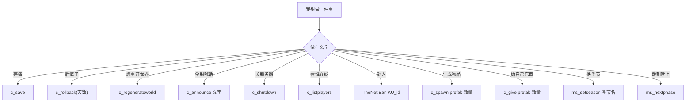

---

## 11. 日志与聊天记录

### 11.1 日志文件在哪？

> 📍 日志位置（地面和洞穴各一套）：
> - 地面：`/home/steam/.klei/DoNotStarveTogether/MyDediServer/Master/`
> - 洞穴：`/home/steam/.klei/DoNotStarveTogether/MyDediServer/Caves/`

| 文件名 | 内容 | 什么时候看它？ |
|--------|------|--------------|
| `server_log.txt` | 完整服务器日志 | 启动报错、玩家进出、死亡记录、模组报错等，**排错必看** |
| `server_chat_log.txt` | 聊天记录 | 想查"谁说了什么"、回溯纠纷时看 |

### 11.2 怎么读日志？

#### 方法 1：实时跟踪日志（最常用）

```bash
# 实时查看地面日志（会持续刷新，按 Ctrl+C 退出）
tail -f /home/steam/.klei/DoNotStarveTogether/MyDediServer/Master/server_log.txt

# 实时查看地面聊天
tail -f /home/steam/.klei/DoNotStarveTogether/MyDediServer/Master/server_chat_log.txt
```

> 💡 `tail -f` 就像是"打开水龙头"——日志文件有新内容写入，屏幕上就会实时显示出来。按 `Ctrl+C` 关水龙头。

#### 方法 2：搜索特定内容

```bash
# 在地面日志里搜索某个玩家的名字
grep "玩家名字" /home/steam/.klei/DoNotStarveTogether/MyDediServer/Master/server_log.txt

# 在聊天记录里搜索包含"hello"的发言
grep "hello" /home/steam/.klei/DoNotStarveTogether/MyDediServer/Master/server_chat_log.txt

# 看日志的最后 100 行
tail -n 100 /home/steam/.klei/DoNotStarveTogether/MyDediServer/Master/server_log.txt
```

> 💡 `grep` 就是"搜索"工具，`grep "关键词" 文件` = "在这个文件里找包含关键词的行"。

### 11.3 日志的生命周期

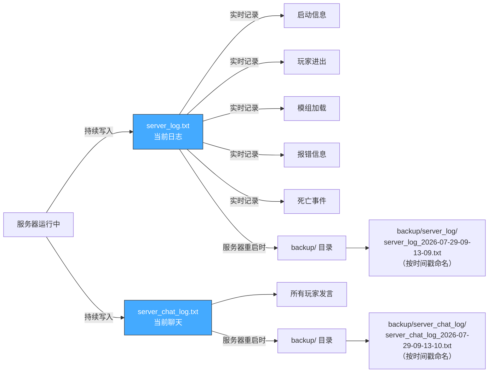

### 11.4 backup/ 目录

每次服务器重启时，旧的日志会被自动归档到 `backup/` 目录，按时间戳命名：

```
Master/
├── server_log.txt                    ← 当前正在写入的日志
├── server_chat_log.txt               ← 当前正在写入的聊天
└── backup/
    ├── server_log/
    │   ├── server_log_2026-07-29-09-13-09.txt   ← 旧日志（按时间命名）
    │   ├── server_log_2026-07-29-10-05-02.txt
    │   └── ...
    └── server_chat_log/
        ├── server_chat_log_2026-07-29-09-13-10.txt
        └── ...
```

> 💡 **小白翻译**：`server_log.txt` 像是"今天的日记本"，`backup/` 像是"去年的日记本柜子"。服务器重启 = 翻开新的一页，旧的一页存进柜子。

---

## 12. 常见问题与故障排除

### 12.1 服务器启动不了

```mermaid
flowchart TD
    A[❌ 服务器启动失败] --> B{检查 cluster_token.txt}
    B -->|文件不存在或为空| C[→ 去游戏里生成令牌，放入文件<br/>详见第 6 章]
    B -->|令牌正确| D{检查端口是否被占用}
    D -->|端口被占用| E[→ 修改 server.ini 的端口<br/>或杀掉占用端口的进程]
    D -->|端口正常| F{检查 cluster_key}
    F -->|地面和洞穴不一致| G[→ 两边改成相同的值]
    F -->|一致| H{查看 server_log.txt}
    H --> I[根据报错信息进一步排查]

    style C fill:#fa4,stroke:#333,color:#fff
    style E fill:#fa4,stroke:#333,color:#fff
    style G fill:#fa4,stroke:#333,color:#fff
```

**排查步骤：**

1. **第一件事：看日志！**
   ```bash
   tail -50 /home/steam/.klei/DoNotStarveTogether/MyDediServer/Master/server_log.txt
   ```
   日志末尾通常会告诉你为什么失败。

2. **令牌问题**：日志出现 `Failed to authenticate` 或 `[2000] ... Cluster token` 相关错误 → 检查 `cluster_token.txt`。

3. **端口冲突**：日志出现 `Address already in use` → 端口被占了，用以下命令查看：
   ```bash
   ss -tulnp | grep 11000
   ```

4. **cluster_key 不匹配**：日志出现 `Shard ... rejected` 或分片连接失败 → 检查 `cluster.ini` 里的 `cluster_key`，确保地面洞穴配置一致。

### 12.2 玩家连不进来

```mermaid
flowchart TD
    A[❌ 玩家连不上服务器] --> B{服务器日志是否显示<br/>Online Server Started？}
    B -->|否| C[→ 服务器没正常启动<br/>参考 12.1]
    B -->|是| D{防火墙/安全组端口开了吗？}
    D -->|没开| E["→ 开放端口 11000/11001<br/>27018/27019/8768/8769<br/>UDP+TCP 全部"]
    D -->|开了| F{服务器在大厅可见吗？}
    F -->|不可见| G[→ 可能是令牌或网络问题<br/>等 5-10 分钟让 Klei 同步]
    F -->|可见但连不上| H{设了密码吗？}
    H -->|是| I[→ 确认玩家输入了正确密码]
    H -->|否| J[→ 检查网络质量<br/>或查看日志是否有踢人记录]

    style C fill:#fa4,stroke:#333,color:#fff
    style E fill:#fa4,stroke:#333,color:#fff
```

**重点检查——防火墙端口清单：**

| 端口 | 协议 | 用途 |
|------|------|------|
| 11000 | UDP + TCP | 地面游戏 |
| 11001 | UDP + TCP | 洞穴游戏 |
| 27018 | UDP | 地面 Steam |
| 27019 | UDP | 洞穴 Steam |
| 8768 | UDP | 地面认证 |
| 8769 | UDP | 洞穴认证 |

> 💡 **云服务器特别注意**：阿里云、腾讯云等需要同时设置**两道防火墙**：
> 1. 系统内的防火墙（`ufw` 或 `firewalld`）
> 2. 云控制台的**安全组规则**
>
> 两道都开才行，漏一道就连不上。

**确认服务器成功启动的标志：** 在 `server_log.txt` 里看到这一行：
```
[2000] ... Online Server Started ... 
```
看到这行说明服务器已经成功对外提供服务了。

### 12.3 模组不生效 / 不加载

```mermaid
flowchart TD
    A[❌ 模组没生效] --> B{dedicated_server_mods_setup.lua<br/>里写了 ServerModSetup 吗？}
    B -->|没写| C[→ 补上 ServerModSetup 模组ID<br/>第一层：下载]
    B -->|写了| D{modoverrides.lua 里<br/>enabled=true 吗？}
    D -->|没有| E[→ 补上 enabled=true<br/>第二层：启用]
    D -->|有了| F{地面和洞穴的<br/>modoverrides.lua<br/>都改了吗？}
    F -->|只改了一个| G[→ 两份都要改！]
    F -->|都改了| H{模组 ID 写对了吗？}
    H -->|ID 不对| I[→ 去 Workshop 确认正确 ID]
    H -->|ID 正确| J[→ 查看日志报错<br/>可能是模组版本不兼容]

    style C fill:#fa4,stroke:#333,color:#fff
    style E fill:#fa4,stroke:#333,color:#fff
    style G fill:#fa4,stroke:#333,color:#fff
```

**常见原因排查表：**

| 症状 | 原因 | 解决方法 |
|------|------|---------|
| 模组文件夹没出现在 `mods/` 目录 | 没在 `dedicated_server_mods_setup.lua` 里声明 | 添加 `ServerModSetup("ID")` |
| 文件夹在，但游戏里没效果 | 没在 `modoverrides.lua` 里启用 | 添加 `["workshop-ID"] = { enabled = true }` |
| 地面有效果，洞穴没有 | 只改了地面的 `modoverrides.lua` | 洞穴那份也要同样修改 |
| 日志报 `mod is not compatible` | 模组版本和服务端版本不匹配 | 更新模组或更新服务端 |
| 日志报 `all_clients_require_mod` 相关 | 该模组要求客户端也安装 | 玩家需要在自己电脑上也订阅该模组 |

### 12.4 洞穴连不上地面（玩家跳井后掉线）

这是最经典的故障之一，通常由以下三个原因之一导致：

```mermaid
flowchart TD
    A[❌ 洞穴与地面连不上] --> B{pause_when_empty}
    B -->|是 true| C[→ 必须改为 false！]
    B -->|是 false| D{cluster_key 一致吗？}
    D -->|地面洞穴不一致| E[→ 两边改成相同值]
    D -->|一致| F{master_ip 正确吗？}
    F -->|不是 127.0.0.1| G[→ 同一台机器改为 127.0.0.1]
    F -->|是 127.0.0.1| H{两个分片都启动了吗？}
    H -->|只启动了地面| I[→ 也要启动洞穴：-shard Caves]
    H -->|都启动了| J[✅ 检查日志确认握手成功]

    style C fill:#d44,stroke:#333,color:#fff
    style E fill:#d44,stroke:#333,color:#fff
    style G fill:#d44,stroke:#333,color:#fff
    style J fill:#2d8,stroke:#333,color:#fff
```

**三大必检项：**

| 检查项 | 正确值 | 在哪个文件 |
|--------|--------|-----------|
| `pause_when_empty` | **必须 `false`** | `cluster.ini` → `[GAMEPLAY]` |
| `cluster_key` | 地面洞穴**必须完全相同** | `cluster.ini` → `[SHARD]` |
| `master_ip` | 同一台机器用 **`127.0.0.1`** | `cluster.ini` → `[SHARD]` |

> 💡 **小白翻译**：地面和洞穴就像两层楼，`cluster_key` 是楼层的**对讲机频道**，`master_ip` 是**内线电话号码**，`pause_when_empty` 是**是否允许楼层之间一直保持通话**。三个都对了，两层楼才能连通。

### 12.5 万能排错流程

遇到任何问题，按这个流程走：

```mermaid
flowchart TD
    A[遇到问题] --> B[第 1 步：看日志]
    B --> C["tail -50 .../Master/server_log.txt"]
    C --> D{日志有明确报错吗？}
    D -->|有| E[根据报错搜索解决方案]
    D -->|没有明显报错| F[第 2 步：检查基础项]
    F --> F1[令牌正确？]
    F --> F2[端口开放？]
    F --> F3[配置文件语法正确？]
    F --> F4[cluster_key 一致？]
    F1 & F2 & F3 & F4 --> G{问题解决？}
    G -->|是| H[✅ 完成]
    G -->|否| I[第 3 步：尝试重启]
    I --> J["c_shutdown 后重新启动"]
    J --> K{解决？}
    K -->|是| H
    K -->|否| L[第 4 步：去社区提问<br/>附上日志和配置]

    style H fill:#2d8,stroke:#333,color:#fff
```

---

## 附录：快速命令速查表

| 我想…… | 命令 |
|--------|------|
| 切换到 steam 用户 | `su - steam` |
| 启动服务器 | `cd /home/steam/dst_server/bin64 && screen -dmS dst_master ./dontstarve_dedicated_server_nullrenderer_x64 -cluster MyDediServer -shard Master` |
| 进入地面控制台 | `screen -r dst_master` |
| 进入洞穴控制台 | `screen -r dst_caves` |
| 退出 screen（不关服） | `Ctrl+A` 然后 `D` |
| 安全关机 | 在控制台输入 `c_shutdown()` |
| 存档 | 在控制台输入 `c_save()` |
| 更新服务端 | `cd /home/steam && ./steamcmd.sh +force_install_dir /home/steam/dst_server +login anonymous +app_update 343050 validate +quit` |
| 看实时日志 | `tail -f /home/steam/.klei/DoNotStarveTogether/MyDediServer/Master/server_log.txt` |
| 搜索日志 | `grep "关键词" /home/steam/.klei/DoNotStarveTogether/MyDediServer/Master/server_log.txt` |
| 查看在线玩家 | 控制台输入 `c_listplayers()` |
| 查看运行中的 screen | `screen -ls` |

---

> 📝 **最后的话**：开服务器就像养一盆植物——刚开始需要花点时间了解它的习性（配置文件），之后只需要定期浇水（存档、更新）和偶尔修剪（排查问题）。遇到问题别慌，**先看日志**，99% 的问题日志都会告诉你答案。祝你开服顺利！🎮
