# 饥荒联机版（DST）技术解析：从零理解游戏引擎内部原理

> **本文面向非技术人员**——你不需要懂编程，也能看懂。
> 文中所有文件路径、配置项均来自本服务器真实环境，可直接对照操作。
> 最后更新：2026-07-30

---

## 目录

1. [饥荒联机版是什么](#1-饥荒联机版是什么)
2. [服务器是怎么启动的](#2-服务器是怎么启动的)
3. [脚本系统：Lua 引擎](#3-脚本系统lua-引擎)
4. [压缩文件与数据包](#4-压缩文件与数据包)
5. [图片系统：.tex 与 .xml](#5-图片系统tex-与-xml)
6. [动画系统](#6-动画系统)
7. [语言包与汉化系统](#7-语言包与汉化系统)
8. [服务器与客户端如何交互](#8-服务器与客户端如何交互)
9. [世界生成原理](#9-世界生成原理)
10. [模组加载机制详解](#10-模组加载机制详解)
11. [存档与回档系统](#11-存档与回档系统)
12. [声音系统](#12-声音系统)

---

## 1. 饥荒联机版是什么

**饥荒联机版**（Don't Starve Together，简称 DST）是 Klei Entertainment 开发的多人合作生存游戏。玩家在一个充满奇怪生物和危险的世界里收集资源、建造基地、对抗四季 Boss、努力活下去。

### 引擎：自研 C++ + Lua 脚本

饥荒用的**不是** Unity、也不是 Unreal Engine。Klei 从《饥荒》单机版开始就有一套**自研引擎**：

| 层级 | 语言 | 负责什么 |
|------|------|----------|
| **底层引擎** | C++ | 图形渲染、物理碰撞、网络通信、音频播放、文件读写 |
| **游戏逻辑** | Lua | 物品定义、生物 AI、配方规则、季节变化、界面交互 |

> **打个比方**：C++ 引擎就像一台电脑的**硬件 + 操作系统**，它提供基础能力（显示画面、播放声音、联网）；Lua 脚本就像一个个**应用程序**，决定游戏里"剑能砍多少伤害""冬天什么时候来""Boss 有多少血"。

这种设计的好处是：**改游戏不需要重新编译 C++ 代码**。玩家甚至可以在 Lua 脚本层做模组（Mod），完全不用碰底层。

### 架构：客户端-服务器模型

DST 是**权威服务器**（Authoritative Server）架构——服务器说了算：

```
  ┌──────────┐         ┌──────────┐         ┌──────────┐
  │  玩家 A   │◄───────►│          │◄───────►│  玩家 C   │
  │ (客户端)  │  网络包  │  服务器   │  网络包  │ (客户端)  │
  └──────────┘         │ (权威的)  │         └──────────┘
                       │          │
  ┌──────────┐         │  跑模拟  │
  │  玩家 B   │◄───────►│          │
  │ (客户端)  │         └──────────┘
  └──────────┘
```

- **服务器**运行整个世界的模拟：计算伤害、移动、生成怪物、管理天气
- **客户端**只负责发送玩家的操作（按键、点击），接收并显示世界状态
- 客户端不能"自己说了算"——你说"我砍了树"，必须服务器确认才算数

这就杜绝了作弊：即使客户端被修改，服务器不认可的操作不会生效。

---

## 2. 服务器是怎么启动的

### 2.1 可执行文件

服务器核心程序位于：

```
/home/steam/dst_server/bin64/dontstarve_dedicated_server_nullrenderer_x64
```

大小仅 5.3MB——这么小，是因为大部分游戏逻辑（54MB）在 Lua 脚本里，而素材文件（图片/动画/声音）单独存放。

### 2.2 "nullrenderer" 是什么意思？

这个超长名字里藏着一个关键信息：

| 词 | 含义 |
|----|------|
| `dontstarve_dedicated_server` | 饥荒**专用服务器**（Dedicated Server） |
| `nullrenderer` | **无渲染器**——不画任何画面 |
| `x64` | 64 位版本 |

> **打个比方**：普通游戏客户端像一个"有屏幕的电影院"——既要演电影又要放给你看。而 nullrenderer 服务器像一个"只有厨房没有大厅的外卖店"——专心做饭（跑模拟），不做展示。这样省下了大量显卡资源。

服务器上没有显示器，也装不了显卡驱动，所以必须用"无渲染器"版本。

### 2.3 启动命令与参数

服务器通过命令行参数指定要加载的"世界集群"和"分片"：

```bash
./dontstarve_dedicated_server_nullrenderer_x64 \
  -cluster MyDediServer \
  -shard Master
```

| 参数 | 含义 |
|------|------|
| `-cluster MyDediServer` | 世界集群名，对应 `~/.klei/DoNotStarveTogether/MyDediServer/` |
| `-shard Master` | 分片名，`Master`=地上世界，`Caves`=地下洞穴 |

一个"集群"（Cluster）包含一个或多个"分片"（Shard）。最典型的配置：

```
MyDediServer/
├── cluster.ini          ← 集群全局配置
├── Master/              ← 地上世界分片
│   ├── server.ini
│   ├── modoverrides.lua
│   └── leveldataoverride.lua
└── Caves/               ← 地下洞穴分片
    ├── server.ini
    ├── modoverrides.lua
    └── leveldataoverride.lua
```

### 2.4 启动流程详解

下面是一台 DST 服务器从按下开机到"可连接"的**完整启动流程**：

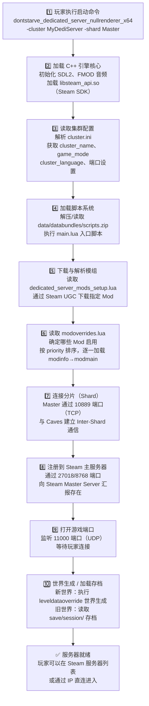

### 2.5 cluster.ini 实例

本服务器的实际配置（`~/.klei/DoNotStarveTogether/MyDediServer/cluster.ini`）：

```ini
[GAMEPLAY]
game_mode = survival          # 生存模式
max_players = 6               # 最多 6 人
pvp = false                   # 关闭玩家对战
pause_when_empty = false      # 没人的时候不暂停

[NETWORK]
cluster_name = My DST Server  # 服务器名称（在浏览器里显示）
cluster_description = A dedicated server for friends

[SHARD]
shard_enabled = true          # 开启分片通信
bind_ip = 127.0.0.1           # 绑定本地地址
master_ip = 127.0.0.1         # Master 分片也在本机
master_port = 10889           # 分片间通信端口
cluster_key = supersecretkey  # 分片间认证密钥
```

---

## 3. 脚本系统：Lua 引擎

### 3.1 游戏逻辑全在 Lua 里

DST 的**所有游戏规则**——物品属性、生物行为、配方配方、季节系统、角色技能——全部用 **Lua** 语言编写。

Lua 是一种轻量级脚本语言，特点是"嵌入"到 C/C++ 程序中运行。DST 的 C++ 引擎内嵌了一个 Lua 解释器，启动时读取并执行所有游戏脚本。

> **打个比方**：C++ 引擎是一台**洗衣机**（提供电机、滚筒、进水功能）；Lua 脚本是那张**洗涤程序单**（决定洗多久、用什么水温、脱水多快）。你可以改程序单（Lua），而不用拆洗衣机（C++）。

### 3.2 脚本在哪里？

所有脚本被打包在一个压缩文件里：

```
/home/steam/dst_server/data/databundles/scripts.zip   （54MB）
```

你可以将其解压出来查看和修改：

```bash
cd /home/steam/dst_server/data/
mkdir -p scripts
cd scripts
unzip ../databundles/scripts.zip
```

解压后你会得到 `scripts/` 目录，里面有数千个 `.lua` 文件。

### 3.3 C++ 引擎与 Lua 脚本的关系

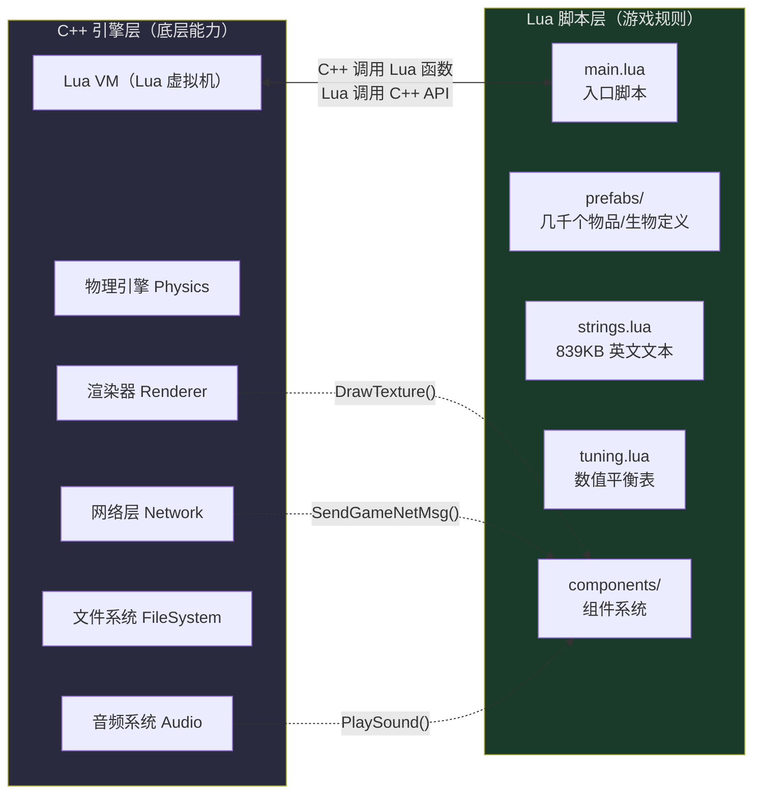

C++ 引擎通过**绑定函数**把底层能力暴露给 Lua。例如：

- Lua 想播放声音 → 调用 C++ 的 `TheFrontEnd:PlaySound()`
- Lua 想创建一个实体 → 调用 C++ 的 `CreateEntity()`
- C++ 发现玩家被攻击 → 回调 Lua 的伤害计算函数

### 3.4 关键脚本文件

| 文件 | 大小 | 作用 |
|------|------|------|
| `main.lua` | 14KB | **入口脚本**——游戏启动后第一个执行的 Lua 文件 |
| `strings.lua` | **839KB** | **英文文本总表**——游戏里所有英文文字的"字典" |
| `tuning.lua` | — | **数值表**——血量、伤害、饥饿速度等所有数字 |
| `customize.lua` | 62KB | 世界生成选项定义（对应创建世界时的设置面板） |
| `prefabs/*.lua` | — | 每个物品/生物一个文件（`axe.lua`=斧头，`deerclops.lua`=独眼巨鹿） |

### 3.5 为什么 Klei 要打包脚本？

把数千个 `.lua` 文件压缩成一个 `scripts.zip`，有两个好处：

1. **启动快**：读 1 个大文件远快于读 5000 个小文件（磁盘 I/O 的"次数"才是瓶颈）
2. **加载更少**：压缩后体积更小，从磁盘读的字节数更少

> **黄金规则**：如果你想修改脚本，只需把 `scripts.zip` **重命名**（比如改成 `scripts.zip.bak`），然后把解压出的 `scripts/` 目录放在 `data/` 下。引擎发现 zip 不在了，就会去读散装文件。

---

## 4. 压缩文件与数据包

### 4.1 data/ 目录全貌

```bash
/home/steam/dst_server/data/
├── databundles/       ← 压缩数据包（游戏素材的主体）
├── anim/              ← 动画文件（解压后 3523 个）
├── bigportraits/      ← 角色大头像（367 个 .tex）
├── images/            ← UI 图片、物品图标（958 个 .tex）
├── minimap/           ← 小地图图标
├── sound/             ← 音频文件（991MB）
├── fonts/             ← 字体文件（在 fonts.zip 里）
├── fx/                ← 特效粒子
├── levels/            ← 关卡定义
├── movies/            ← 开场动画视频
└── unsafedata/        ← 用户数据
```

### 4.2 databundles/ 里的压缩包

本服务器 `databundles/` 的实际内容：

| 文件 | 大小 | 内容 |
|------|------|------|
| `scripts.zip` | **54MB** | 所有 Lua 游戏脚本 + 15 种语言包 |
| `images.zip` | **32MB** | UI 界面图片、物品图标 |
| `fonts.zip` | **17MB** | 各种字体文件 |
| `anim_dynamic.zip` | **16MB** | 动态动画 |
| `bigportraits.zip` | 91KB | 角色大头像（压缩后很小） |
| `shaders.zip` | 91KB | 着色器（渲染程序） |
| `klump.zip` | 235B | Klump 资源（极小） |

### 4.3 为什么要打包？

> **打个比方**：假设你要搬家，有 5000 本书。你可以：
> - **方案 A**：一本一本搬，跑 5000 趟 → 超级慢
> - **方案 B**：全部装进一个大箱子，跑 1 趟 → 快得多

Klei 选择了方案 B。5000 个散装 Lua 文件打包成一个 `scripts.zip`，磁盘只需要读取 1 次。游戏启动速度大幅提升。

### 4.4 如何解压与修改？

**三步操作**：

```bash
# 第 1 步：解压
cd /home/steam/dst_server/data/
unzip databundles/scripts.zip -d .      # 得到 scripts/ 目录

# 第 2 步：改名（让游戏不再读 zip）
mv databundles/scripts.zip databundles/scripts.zip.bak

# 第 3 步：修改后重启服务器
```

### 4.5 数据包加载优先级

引擎读取文件时有一个**优先级链**——散装文件优先于压缩包：

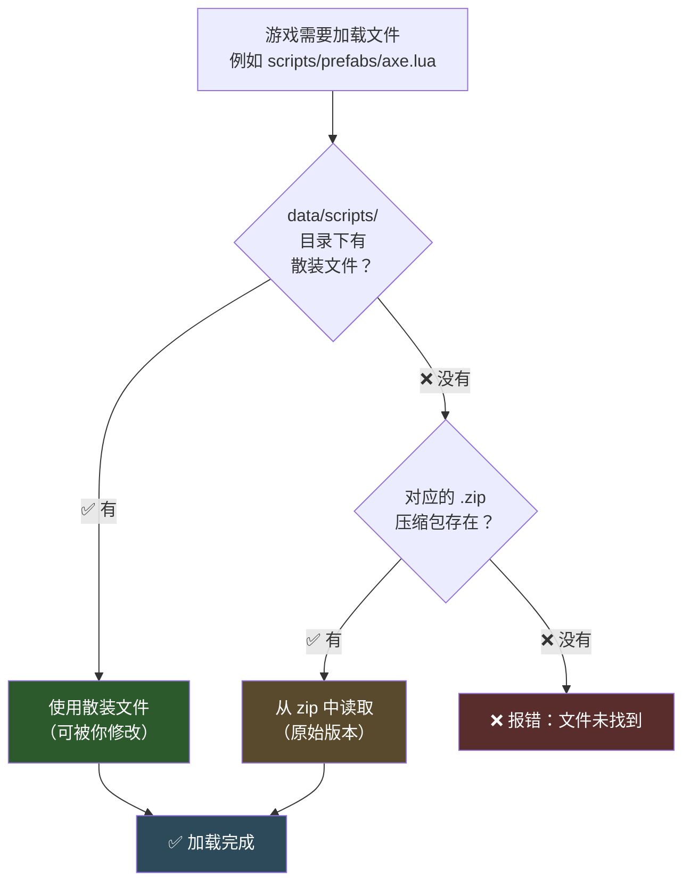

> **这就是模组工作的基础**：模组不需要修改 zip 包里的原始文件，只需"覆盖"或"钩住"对应的 Lua 函数。引擎会优先读取模组提供的版本。

---

## 5. 图片系统：.tex 与 .xml

这是新手最容易困惑的部分。DST 的图片系统与普通 PNG/JPEG 截然不同。

### 5.1 .tex 文件——Klei 专有纹理格式

打开 `data/images/` 目录，你会看到 958 个 `.tex` 文件。这些**不是**普通图片：

| 特征 | 普通图片（PNG/JPG） | DST 的 .tex 文件 |
|------|---------------------|-------------------|
| 格式 | 通用标准 | **Klei 私有格式** |
| 文件头 | PNG / JFIF | **`KTEX`**（4 字节魔术头） |
| 能否用图片查看器打开 | ✅ 能 | ❌ **不能** |
| 压缩方式 | PNG zlib / JPEG | DXT / RGBA 纹理压缩（GPU 直读） |

我们来验证一下——读取本服务器上的 `.tex` 文件开头：

```
文件：data/images/anr_silhouettes.tex
前 4 字节：4B 54 45 58 = "KTEX"  ✓
```

> **打个比方**：`.tex` 文件就像一种"只有 Klei 家洗衣机认得的外卖盒"。普通图片查看器打开它，就像用微波炉热铁饭盒——完全不对路。

### 5.2 如何转换 .tex？

你不能直接编辑 `.tex`，需要先转换成 PNG，改完再转回去：

**方法一：ktools（最常用）**

社区工具 `ktools`（由 matt 开发）可以将 `.tex` ↔ `.png` 互转：

```bash
# .tex 转 .png
ktech --decode item.tex            # → 生成 item.png

# .png 转 .tex
ktech --encode item.png            # → 生成 item.tex
```

**方法二：游戏内置导出器**

DST 客户端自带一个 TEX 导出器（`tools/` 目录下），但不如 ktools 好用。

### 5.3 .xml 图集文件——UV 坐标"说明书"

一个 `.tex` 纹理图往往**很大**，里面拼了很多小图。`.xml` 文件就是这些小图的"位置说明书"。

来看本服务器的真实例子——`anr_silhouettes.xml`：

```xml
<Atlas>
  <Texture filename="anr_silhouettes.tex" />
  <Elements>
    <Element name="silhouette_beta_1.tex"
             u1="0.000244140625" u2="0.124755859375"
             v1="0.75048828125"  v2="0.99951171875" />
    <Element name="silhouette_beta_2.tex"
             u1="0.125244140625" u2="0.249755859375"
             v1="0.75048828125"  v2="0.99951171875" />
    <!-- ... 更多 Element ... -->
  </Elements>
</Atlas>
```

#### UV 坐标通俗解释

> **打个比方**：想象一张超大的画布（.tex 纹理图），上面画了很多小插画。
>
> 你想在屏幕上显示其中一幅。你怎么告诉电脑"我要哪一幅"？
>
> 答案：给它一个**框**——左边界在哪（u1），右边界在哪（u2），上边界在哪（v1），下边界在哪（v2）。
>
> UV 坐标是**百分比**（0.0~1.0），不是像素：
> - `u1=0.0` = 最左边，`u1=0.5` = 正中间
> - `v1=0.0` = 最底下，`v1=1.0` = 最顶上
>
> 就像在画布上用相框框出一幅画，然后把它剪下来显示。

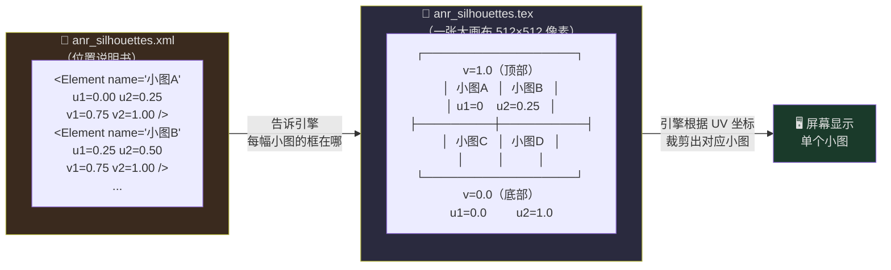

### 5.4 图片都在哪里？

| 目录 | 路径 | 内容 |
|------|------|------|
| **UI 图片** | `data/images/` | 界面背景、物品图标、按钮等（958 个 .tex） |
| **角色大头像** | `data/bigportraits/` | 对话时的全身像（367 个 .tex） |
| **小地图图标** | `data/minimap/` | 地图上各种标记 |

### 5.5 模组图标

每个模组都需要一个图标，放在模组根目录，与 `modinfo.lua` 同级：

```
mods/workshop-1301033176/
├── modinfo.lua          ← 元信息
├── modmain.lua          ← 代码
├── modicon.tex          ← 图标图片（KTEX 格式）
└── modicon.xml          ← 图标的 UV 坐标
```

在 `modinfo.lua` 中声明：

```lua
icon_atlas = "modicon.xml"
icon = "modicon.tex"
```

---

## 6. 动画系统

### 6.1 动画文件概述

DST 的动画系统由三个文件协同工作：

| 文件类型 | 作用 | 比喻 |
|----------|------|------|
| `.anim` | 动画时间线（每帧播放什么） | **乐谱**（什么时候吹什么音） |
| `build` | 各部件的图片贴图 | **乐器**（长什么样） |
| `atlas` | 部件在纹理图上的位置 | **乐器的弦在哪** |

```
data/anim/    ← 3523 个动画压缩包
├── abigail_attack_fx.zip
├── bearger.zip         ← 熊獾 Boss 的动画
├── deerclops.zip       ← 独眼巨鹿的动画
├── wilson.zip          ← Wilson 角色动画
└── ...
```

### 6.2 动画是如何组成的

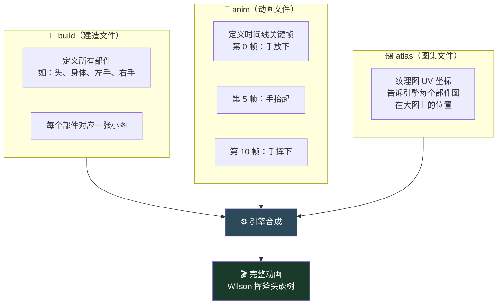

### 6.3 模组与动画

模组可以在自己的目录下放 `anim/` 文件夹来添加自定义动画：

```
mods/workshop-1965741394/    （Shipwrecked 船难模组）
├── modmain.lua
├── anim/                     ← 模组自定义动画
│   ├── boat_row.zip
│   ├── twister.zip           ← 龙卷风 Boss 动画
│   └── ...
└── ...
```

---

## 7. 语言包与汉化系统

这是本文最详细的章节，因为**服务器汉化**是最常遇到问题的地方。

### 7.1 官方支持的语言

DST 原生支持 **15 种语言**。这些语言文件位于 `scripts.zip` 内的 `scripts/languages/` 目录：

| 文件名 | 语言 | 大小 |
|--------|------|------|
| `chinese_s.po` | **简体中文** | 16.8MB |
| `chinese_t.po` | **繁体中文** | 16.8MB |
| `japanese.po` | 日本語 | 17.9MB |
| `korean.po` | 한국어 | 17.2MB |
| `russian.po` | Русский | 18.9MB |
| `french.po` | Français | 17.2MB |
| `german.po` | Deutsch | 17.1MB |
| `spanish.po` | Español | 17.0MB |
| `spanish_mex.po` | Español (México) | 15.2MB |
| `portuguese_br.po` | Português (Brasil) | 17.0MB |
| `italian.po` | Italiano | 17.0MB |
| `polish.po` | Polski | 16.9MB |
| `strings.pot` | 翻译模板（英文原文） | 14.2MB |
| `loc.lua` | 语言映射逻辑 | 6.5KB |
| `language.lua` | 语言列表定义 | 1.1KB |

> 注意：还有一些语言（如 Turkish 土耳其语）可能在某些版本中通过社区模组提供。

### 7.2 语言加载流程

当游戏启动或玩家切换语言时，会执行以下流程：

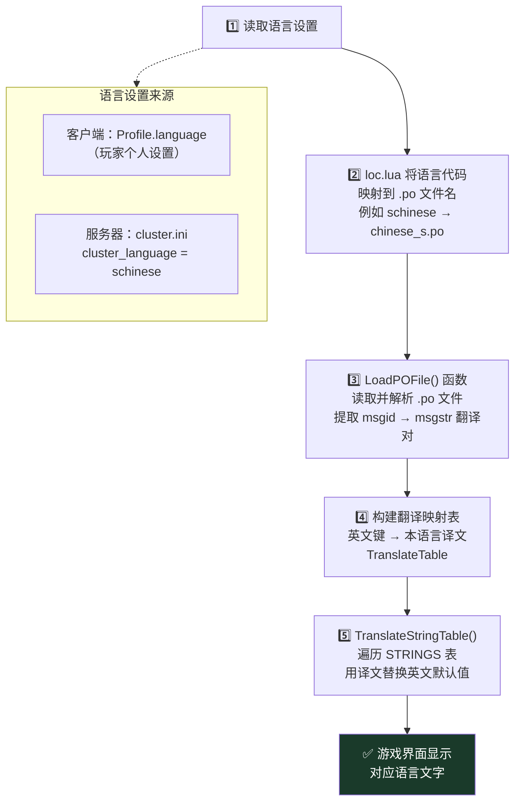

**服务器端获取语言的两种方式**：

```ini
# 方式一：在 cluster.ini 中设置（影响服务器公告、浏览器标签等）
# 不存在此字段时，服务器默认使用英文

# 方式二：通过中文语言包模组（workshop-1301033176）
# 模组会强制设置服务器语言并加载完整翻译
```

### 7.3 STRINGS 表——游戏的"电话簿"

`strings.lua`（839KB）定义了游戏里**所有英文文本**。它的结构像一本电话簿：

```lua
STRINGS = {
    NAMES = {
        axe = "Axe",                  -- 斧头
        spear = "Spear",              -- 矛
        deerclops = "Deerclops",      -- 独眼巨鹿
        ...
    },
    ACTIONS = {
        ATTACK = {
            GENERIC = "Attack",       -- 攻击
        },
        CHOP = {
            GENERIC = "Chop",         -- 砍
        },
        ...
    },
    RECIPE_DESC = {
        axe = "The first tool you'll need.",  -- 配方描述
        ...
    },
    CHARACTERS = {
        GENERIC = {
            DESCRIBE = {
                AXE = "It's an axe.",  -- 角色检查物品的台词
            },
        },
    },
}
```

> **打个比方**：STRINGS 表就像一本**超级电话簿**。你想找"斧头的英文名叫什么"，翻到 `NAMES` 分册，找到 `axe` 条目，上面写着 `"Axe"`。

每个文本都有一个**点号路径**（dotted path）：

```
STRINGS.NAMES.AXE           → "Axe"
STRINGS.ACTIONS.ATTACK.GENERIC → "Attack"
STRINGS.RECIPE_DESC.AXE     → "The first tool you'll need."
```

这些路径就是翻译的"键名"。

### 7.4 .po 文件格式详解

`.po`（Portable Object）是标准的翻译文件格式。来看一个实际条目：

```po
# 物品名称
msgctxt "STRINGS.NAMES.AXE"
msgid "Axe"
msgstr "斧头"

# 配方描述
msgctxt "STRINGS.RECIPE_DESC.AXE"
msgid "The first tool you'll need."
msgstr "你需要的第一个工具。"

# 角色台词
msgctxt "STRINGS.CHARACTERS.GENERIC.DESCRIBE.AXE"
msgid "It's an axe."
msgstr "这是一把斧头。"
```

| 字段 | 含义 | 举例 |
|------|------|------|
| `msgctxt` | STRINGS 表中的路径（键名） | `STRINGS.NAMES.AXE` |
| `msgid` | 英文原文 | `Axe` |
| `msgstr` | 翻译后的文本 | `斧头` |

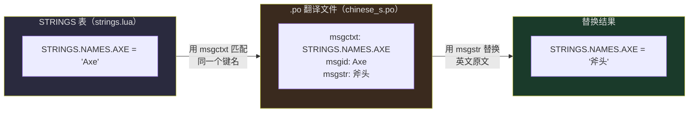

### 7.5 模组汉化的两种方法

#### 方法 A：自带 .po 文件（推荐）

模组自己带一个翻译文件，在 `modmain.lua` 中加载：

```lua
-- modmain.lua
-- 加载本模组目录下的 DST_chs.po 翻译文件
LoadPOFile("DST_chs.po", "chs")

-- 将翻译应用到全局 STRINGS 表
GLOBAL.TranslateStringTable(GLOBAL.STRINGS)
```

**优点**：干净、标准、支持多语言切换

本服务器上的**汉化包模板**（`/home/steam/DSTserver/examples/i18n-mod-template/`）就是用这种方法：

```lua
-- 读取配置选择语言
local LANG = GetModConfigData("LANG") or "simplified"
local code = choose[LANG]  -- "chs" 或 "cht"

-- 加载翻译文件
local pofile = "DST_" .. code .. ".po"
LoadPOFile(pofile, code)

-- 应用翻译
_G.TranslateStringTable(_G.STRINGS)
```

#### 方法 B：直接修改 STRINGS 表

不使用 .po 文件，直接在 Lua 代码中赋值：

```lua
-- modmain.lua
-- 直接把英文字符串改成中文
GLOBAL.STRINGS.NAMES.AXE = "斧头"
GLOBAL.STRINGS.NAMES.SPEAR = "矛"
GLOBAL.STRINGS.RECIPE_DESC.AXE = "你需要的第一个工具。"
```

**优点**：简单粗暴，不需要写 .po 文件
**缺点**：如果原游戏更新加了新物品，你得手动加翻译；不优雅

### 7.6 中文语言包模组实例

**Chinese Language Pack**（Workshop ID: `1301033176`）是最常用的汉化模组。它的工作方式：

```
mods/workshop-1301033176/
├── modinfo.lua
├── modmain.lua
├── DST_chs.po          ← 简体中文翻译（5.2MB，数万条翻译）
├── DST_cht.po          ← 繁体中文翻译
└── ...
```

这个模组做了两件事：

1. **加载翻译**：调用 `LoadPOFile("DST_chs.po", "chs")` + `TranslateStringTable(STRINGS)`
2. **修复中文正则 Bug**：DST 原版的 `string.match` 函数对中文字符（UTF-8 多字节）处理有 Bug。这个模组**打了补丁**（patch），替换了 `string.match` 函数，使其正确处理中文字符。

### 7.7 为什么服务器也需要语言包？

很多人觉得"语言包是客户端的事，服务器不需要"。但在 DST 中，**服务器也需要**：

| 场景 | 为什么需要 |
|------|-----------|
| **服务器公告** | `c_announce("服务器将在 5 分钟后重启")` → 服务器生成公告文字 |
| **浏览器标签** | Steam 服务器列表里显示的 `cluster_name`、`cluster_description` |
| **死亡/击杀通知** | "Wilson was killed by Deerclops" → 如果服务器没有中文，这条消息是英文的 |
| **聊天系统** | 服务器端处理聊天消息时的字符串操作 |

> 简而言之：**服务器也要"说话"**。如果服务器说的是英文，那即使客户端装了中文包，某些服务器生成的消息仍会显示英文。

---

## 8. 服务器与客户端如何交互

### 8.1 权威服务器模型

DST 采用严格的**服务器权威**模型：

- **服务器**拥有世界的"真值"（True State）——所有实体的位置、血量、状态
- **客户端**只拥有服务器"授权"给它的权限（主要是移动和输入）
- 所有**游戏规则判定**（伤害计算、物品掉落、合成结果）都由服务器执行

### 8.2 完整网络架构

以本服务器的双分片（Master + Caves）配置为例，所有端口一览：

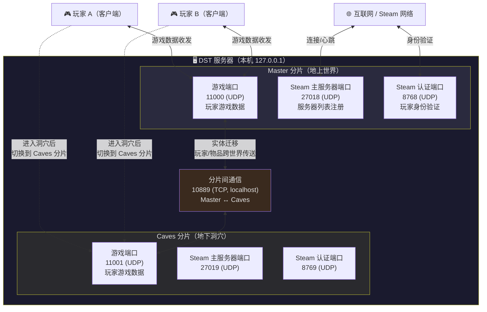

### 8.3 端口详解

| 端口 | 协议 | 分片 | 用途 |
|------|------|------|------|
| **11000** | UDP | Master | 地上世界的**游戏数据**（玩家移动、交互、世界状态同步） |
| **11001** | UDP | Caves | 地下洞穴的**游戏数据** |
| **27018** | UDP | Master | 向 Steam 主服务器**注册**（让服务器出现在浏览器列表中） |
| **27019** | UDP | Caves | Caves 分片的 Steam 注册 |
| **8768** | UDP | Master | Steam **身份验证**（验证玩家是否正版） |
| **8769** | UDP | Caves | Caves 分片的身份验证 |
| **10889** | TCP | 本机 | **分片间通信**（Master 与 Caves 互传数据） |

> **防火墙必须放行**：11000-11001 (TCP+UDP)、27018-27019 (UDP)、8768-8769 (UDP)。10889 只需 localhost，不需要对外开放。

### 8.4 分片迁移系统（Shard Migration）

当玩家从地上世界跳进洞口，或从洞穴爬回地面时，会发生**分片迁移**：

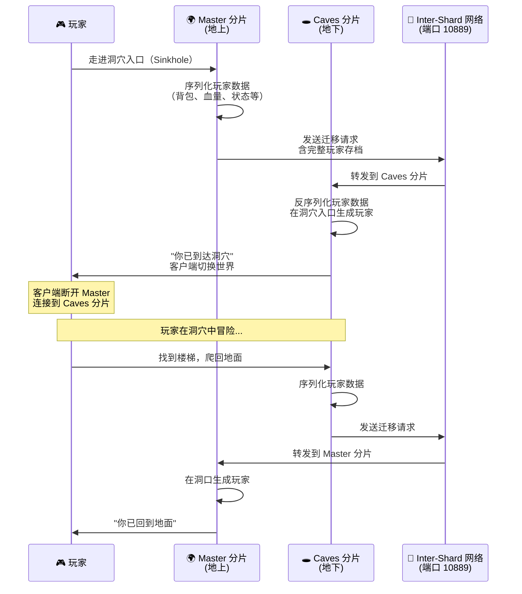

> **打个比方**：分片迁移就像你从 A 城市坐火车到 B 城市。A 城市的车站（Master）把你的行李打包好（序列化），通过铁路（10889 端口）发到 B 城市（Caves）。B 城市收到后把行李拆开（反序列化），你就在 B 城市出现了。整个过程中你的所有物品和状态都不会丢失。

---

## 9. 世界生成原理

### 9.1 leveldataoverride.lua

每个分片（Master/Caves）都有一个 `leveldataoverride.lua` 文件，控制该世界的生成参数：

```
~/.klei/DoNotStarveTogether/MyDediServer/
├── Master/
│   └── leveldataoverride.lua    ← 地上世界生成参数
└── Caves/
    └── leveldataoverride.lua    ← 地下洞穴生成参数
```

一个典型的 `leveldataoverride.lua`：

```lua
return {
    -- 使用预设世界类型
    ["preset"] = "SURVIVAL_DEFAULT",

    -- 覆盖项
    ["override_options"] = {
        ["world_size"] = "large",           -- 地图大小：small/medium/large/huge
        ["season_start"] = "autumn",        -- 开局季节：spring/summer/autumn/winter
        ["day_length"] = "default",         -- 白天长度
        ["autumn"] = "default",             -- 秋季长度设置
        ["winter"] = "default",             -- 冬季长度设置
        ["deerclops"] = "always",           -- 独眼巨鹿出现频率
        ["berrybush"] = "often",            -- 浆果丛数量
    },
}
```

### 9.2 世界预设（Preset）

预设是预定义的"世界配方"：

| 预设名 | 说明 |
|--------|------|
| `SURVIVAL_DEFAULT` | 标准生存模式（默认） |
| `FOREST` | 地上世界基础模板 |
| `CAVES` | 地下洞穴基础模板 |
| `COMPLETE_DARKNESS` | 永夜模式 |
| `DEFAULT_PLUS` | 标准增强版 |

### 9.3 常见覆盖键

| 键名 | 作用 | 可选值 |
|------|------|--------|
| `world_size` | 地图尺寸 | `small`, `medium`, `large` |
| `season_start` | 初始季节 | `spring`, `summer`, `autumn`, `winter` |
| `day_length` | 白天比例 | `default`, `longday`, `longdusk`, `longnight` |
| `weather` | 天气频率 | `default`, `lotsrain`, `lessshower` |
| `animals` | 动物数量 | `default`, `more`, `less` |
| `trees` | 树木密度 | `default`, `more`, `less` |
| `berrybush` | 浆果丛密度 | `default`, `often`, `rare` |

### 9.4 生成流程

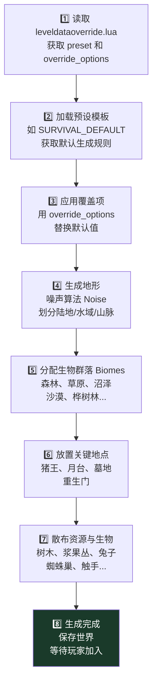

### 9.5 大型模组如何替换世界生成

像 **Shipwrecked Together**（Workshop-1965741394）这样的大型模组会**完全替换预设**：

```
mods/workshop-1965741394/
├── modmain.lua
├── modworldgenmain.lua          ← 自定义世界生成入口
├── modservercreationmain.lua    ← 自定义世界创建界面
├── scripts/
│   ├── flooding.lua             ← 洪水系统
│   └── ...
└── ...
```

这些模组通过：
- 注册全新的 `preset`（如 `SHIPWRECKED`）
- 注入自定义的**地形生成算法**（海岛、潮汐、飓风）
- 用 `customize_patch.lua` 往创建世界的设置面板里添加自己的选项

### 9.6 customize_patch.lua

模组通过 `scripts/customize_patch.lua` 在世界创建设置面板中注入自己的选项：

```lua
-- mods/workshop-XXXX/scripts/customize_patch.lua
AddCustomizeGroup("shipwrecked", "Shipwrecked")   -- 添加一个分组
AddCustomizeOption("shipwrecked", "hurricane", "Hurricane Season", {
    {description = "Default", data = "default"},
    {description = "More", data = "more"},
    {description = "Less", data = "less"},
})
```

这样玩家在创建世界时就能看到模组独有的设置项。

---

## 10. 模组加载机制详解

### 10.1 模组加载全流程

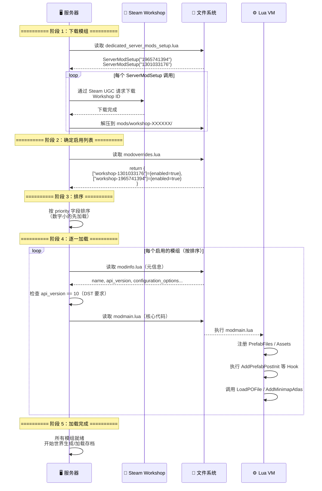

### 10.2 第一步：下载（dedicated_server_mods_setup.lua）

这个文件位于 `mods/dedicated_server_mods_setup.lua`，告诉服务器**启动时要下载哪些模组**：

```lua
-- mods/dedicated_server_mods_setup.lua（本服务器实际内容）
ServerModSetup("1965741394")   -- Shipwrecked 船难
ServerModSetup("1301033176")   -- 中文语言包
ServerModSetup("378160973")    -- Combined Status
ServerModSetup("367546858")    -- Global Player Icons
```

> `ServerModSetup("ID")` = "请帮我从 Workshop 下载 ID 号模组"

### 10.3 第二步：确定启用（modoverrides.lua）

下载 ≠ 启用。每个分片的 `modoverrides.lua` 决定**实际启用哪些模组**：

```lua
-- ~/.klei/DoNotStarveTogether/MyDediServer/Master/modoverrides.lua
return {
    ["workshop-1185229307"] = { enabled = true,  configuration_options = {} },
    ["workshop-1418746242"] = { enabled = true,  configuration_options = {} },
    ["workshop-1595631294"] = { enabled = true,  configuration_options = {} },
    ["workshop-1780476441"] = { enabled = true,  configuration_options = {} },
    ["workshop-1909182187"] = { enabled = true,  configuration_options = {} },
    -- ...
}
```

> **注意**：Caves 分片有自己独立的 `modoverrides.lua`。通常两者启用相同的模组，但某些只在地上/地下生效的模组可以只在对应分片启用。

### 10.4 第三步：加载模组代码

对每个启用的模组，按以下顺序执行：

| 步骤 | 文件 | 作用 |
|------|------|------|
| ① | `modinfo.lua` | 读取元信息：名称、版本、作者、兼容性、配置选项 |
| ② | 检查 `api_version` | **必须是 10** 才兼容 DST（不是 10 会被拒绝加载） |
| ③ | `modmain.lua` | 执行模组核心代码 |

### 10.5 modmain.lua 能做什么？

模组的 `modmain.lua` 是一切魔法的入口：

```lua
-- 注册自定义预制件（物品/生物）
PrefabFiles = {
    "my_custom_sword",
    "my_custom_monster",
}

-- 注册素材资源
Assets = {
    Asset("IMAGE", "images/my_icon.tex"),        -- 图片
    Asset("ATLAS", "images/my_icon.xml"),        -- 图片的 UV
    Asset("SOUNDPACKET", "sound/my_sound.fev"),  -- 声音
    Asset("ANIM", "anim/my_animation.zip"),      -- 动画
}

-- 钩住已有物品的初始化函数（"后初始化" PostInit）
AddPrefabPostInit("spear", function(inst)
    -- 给矛加额外效果
    inst.components.weapon.damage = 100  -- 伤害改成 100
end)

-- 加载小地图图标
AddMinimapAtlas("images/minimap/my_icon.xml")

-- 加载翻译文件
LoadPOFile("DST_chs.po", "chs")
```

| API 函数 | 作用 |
|----------|------|
| `AddPrefabPostInit(name, fn)` | 在物品 `name` 创建后执行 `fn`，修改其行为 |
| `AddPlayerPostInit(fn)` | 在任何玩家角色创建后执行 |
| `AddMinimapAtlas(path)` | 注册小地图图标 |
| `AddStategraphPostInit(name, fn)` | 修改行为状态图（AI/动画状态机） |
| `AddRecipe(...)` | 添加新的合成配方 |
| `LoadPOFile(file, lang)` | 加载语言翻译文件 |

### 10.6 加载优先级

模组的 `modinfo.lua` 中可以设置 `priority`：

```lua
-- modinfo.lua
priority = 0    -- 默认值，数字越小越先加载
```

- `priority = -100` 的模组**最先**加载（适合底层框架/库）
- `priority = 0` 的模组正常加载（大多数模组）
- `priority = 100` 的模组**最后**加载（适合需要覆盖其他模组行为的补丁）

### 10.7 api_version 的意义

```lua
-- modinfo.lua
api_version = 10    -- DST 要求此值
```

| api_version | 对应游戏 |
|-------------|----------|
| `6` | 饥荒单机版 |
| `10` | **饥荒联机版（DST）** |

如果 `api_version` 不是 10，DST 服务器会**拒绝加载**该模组。这就是为什么单机版模组不能直接用在联机服上。

---

## 11. 存档与回档系统

### 11.1 存档目录结构

本服务器的存档位于：

```
~/.klei/DoNotStarveTogether/MyDediServer/Master/save/
├── session/
│   └── 0E67588A1B0A77F8/          ← 世界 GUID（每次新建世界随机生成）
│       ├── 0000000020             ← 第 20 天的存档数据
│       ├── 0000000020.meta        ← 第 20 天的元数据
│       ├── 0000000021             ← 第 21 天的存档数据
│       ├── 0000000021.meta        ← 第 21 天的元数据
│       ├── 0000000022
│       ├── 0000000022.meta
│       ├── 0000000023
│       ├── 0000000023.meta
│       ├── 0000000024
│       ├── 0000000024.meta
│       ├── 0000000025             ← 最新存档（第 25 天）
│       └── 0000000025.meta
├── modindex                       ← 已注册模组索引（二进制）
├── boot_modindex                  ← 启动时的模组快照（二进制）
├── profile                        ← 服务器配置档案
├── shardindex                     ← 分片索引
└── shardindex_time                ← 分片时间戳
```

### 11.2 文件命名规则

| 文件名 | 含义 |
|--------|------|
| `0000000020` | **第 20 天**的存档（10 位数字补零，表示游戏天数） |
| `0000000020.meta` | 第 20 天存档的**元数据**（时间戳、种子、摘要信息） |
| `0000000025` | 最新存档——**第 25 天** |

> 文件名是**天数编号**，不是时间戳。每个游戏日（黎明时分）自动保存一次。

### 11.3 自动保存机制


DST 在**每个游戏日的黎明**（天刚亮时）自动保存一次。这意味着如果你在第 25 天下午崩溃了，最多丢失**不到 1 天**的进度（回档到第 25 天黎明）。

### 11.4 回档机制（Rollback）

通过控制台命令回档：

```lua
c_rollback(3)    -- 回到 3 天前的存档
```

回档过程：

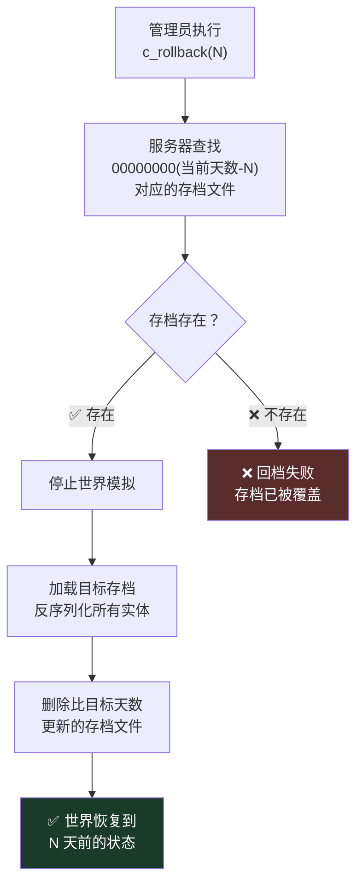

> 默认保留最近 **5 天**的存档。更早的存档会被自动清理以节省磁盘空间。

### 11.5 modindex 与 boot_modindex

| 文件 | 格式 | 作用 |
|------|------|------|
| `modindex` | 二进制 | 记录当前世界**注册的所有模组**及其状态 |
| `boot_modindex` | 二进制 | 记录**启动时**的模组快照 |

这两个文件用于：
- 启动时检测模组列表是否变化（新增/删除模组时可能需要重新生成世界）
- 确保存档与模组版本匹配，防止因模组变更导致存档损坏

---

## 12. 声音系统

### 12.1 概述

DST 使用 **FMOD** 音频引擎（业界常用的游戏音频中间件）。

```
/home/steam/dst_server/data/sound/    ← 991MB，音频文件全部在此
├── *.fev    ← 57 个事件文件
├── *.fsb    ← 153 个音效包文件
└── amb_stream.fsb  ← 环境音流
```

相关的 FMOD 动态库在 `bin64/lib64/`：

| 库文件 | 大小 | 作用 |
|--------|------|------|
| `libfmodex64.so` | 1.5MB | FMOD 主库（音频引擎核心） |
| `libfmodex64-4.44.64.so` | 1.5MB | FMOD 4.44 版本 |
| `libfmodevent64.so` | 553KB | FMOD 事件系统 |

### 12.2 .fev 与 .fsb

| 文件 | 全称 | 作用 | 比喻 |
|------|------|------|------|
| `.fev` | FMOD Event File | 定义**音频事件**（什么时候、什么条件下播放什么声音） | **乐谱**：什么时候演奏什么 |
| `.fsb` | FMOD Sound Bank | 存储实际的**音频数据**（数字化声音波形） | **乐器**：发出声音的源头 |

例如：
- `bearger.fev` = 定义熊獾什么时候吼叫、脚步声什么时候触发
- `bearger.fsb` = 熊獾吼叫声、脚步声的实际音频数据

```
data/sound/
├── bearger.fev       ← 熊獾音频事件定义
├── bearger.fsb       ← 熊獾音效包（864KB）
├── deerclops.fsb     ← 独眼巨鹿音效
├── cave_AMB.fsb      ← 洞穴环境音（7MB）
├── amb_stream.fsb    ← 环境音流（14MB）
├── birds.fsb         ← 鸟叫声
├── bee.fsb           ← 蜜蜂声
└── ...
```

### 12.3 模组与声音

模组可以在自己的目录下创建 `sound/` 文件夹，放置自定义音频：

```
mods/workshop-XXXX/
├── modmain.lua
├── sound/
│   ├── my_monster.fev
│   └── my_monster.fsb
└── ...
```

并在 `modmain.lua` 中注册：

```lua
Assets = {
    Asset("SOUNDPACKET", "sound/my_monster.fev"),
}
```

> **注意**：专用服务器（nullrenderer）**不播放声音**。声音只在客户端播放。服务器上虽然有完整的 `sound/` 目录（991MB），但这些文件主要是为了**文件完整性校验**和**未来可能的转发用途**。大多数情况下，服务器不需要它们。

---

## 附录：快速参考

### 本服务器关键路径一览

| 内容 | 路径 |
|------|------|
| 服务器程序 | `/home/steam/dst_server/bin64/dontstarve_dedicated_server_nullrenderer_x64` |
| 数据目录 | `/home/steam/dst_server/data/` |
| 脚本压缩包 | `/home/steam/dst_server/data/databundles/scripts.zip` |
| 图片压缩包 | `/home/steam/dst_server/data/databundles/images.zip` |
| 动画目录 | `/home/steam/dst_server/data/anim/` |
| 音频目录 | `/home/steam/dst_server/data/sound/` |
| 模组下载目录 | `/home/steam/dst_mods/` |
| 模组下载列表 | `/home/steam/dst_server/mods/dedicated_server_mods_setup.lua` |
| 世界存档 | `~/.klei/DoNotStarveTogether/MyDediServer/Master/save/` |
| 集群配置 | `~/.klei/DoNotStarveTogether/MyDediServer/cluster.ini` |
| 模组启用列表 | `~/.klei/DoNotStarveTogether/MyDediServer/Master/modoverrides.lua` |

### 端口速查表

| 端口 | 协议 | 用途 | 需开放防火墙 |
|------|------|------|-------------|
| 11000 | UDP | 地上世界游戏数据 | ✅ |
| 11001 | UDP | 地下洞穴游戏数据 | ✅ |
| 27018 | UDP | Steam 主服务器注册（地上） | ✅ |
| 27019 | UDP | Steam 主服务器注册（洞穴） | ✅ |
| 8768 | UDP | Steam 认证（地上） | ✅ |
| 8769 | UDP | Steam 认证（洞穴） | ✅ |
| 10889 | TCP | 分片间通信 | ❌ 仅本机 |

---

> **文档结束。** 如有疑问，可对照本服务器的实际文件进行验证。所有路径、端口号、文件大小均为本服务器的真实数据。
