# DST Server Panel — 项目技术文档

> 基于 [Mermaid 流程图语法](https://blog.csdn.net/qq_45324272/article/details/159680814) 与 [Mermaid 高级语法](https://blog.csdn.net/qq_45324272/article/details/159682198) 编写，所有图表使用 Mermaid 渲染。

---

## 一、项目概述

**DST Server Panel** 是一个《饥荒联机版》（Don't Starve Together）专用服务器的 Web 管理面板，部署在 Linux 服务器上，通过浏览器完成服务器的启动/停止、世界编辑、模组管理、控制台指令、玩家管理等全部操作。

| 项目信息 | 说明 |
|----------|------|
| 游戏AppID | `343050`（DST 专用服务器） |
| 操作系统 | Debian GNU/Linux 13 (trixie) x86_64 |
| 运行用户 | `steam` (UID 1000) |
| 面板端口 | `127.0.0.1:5323`（仅回环，通过 nginx 反代对外） |
| 公网入口 | nginx → `/dst/` → `127.0.0.1:5323`（端口 80） |

---

## 二、技术栈

### 后端

| 技术 | 说明 |
|------|------|
| **运行时** | [Bun](https://bun.sh/) v1.3.14（高性能 JS/TS 运行时） |
| **语言** | TypeScript（`"type": "module"`） |
| **HTTP** | `Bun.serve()` 内置 HTTP 服务器 |
| **文件系统** | `node:fs`、`node:path` 原生模块 |
| **加密** | `node:crypto`（SHA-256 HMAC 签名） |
| **进程控制** | `screen` 会话注入 + `Bun.spawn()` |
| **外部工具** | `steamcmd`（模组下载/服务器更新）、`curl`（CDN 下载）、`unzip`（解压） |
| **依赖** | **零 npm 依赖**，仅使用 Bun 内置 + Node 兼容模块 |

### 前端

| 技术 | 说明 |
|------|------|
| **框架** | 原生 JavaScript（无框架，无构建步骤） |
| **样式** | 原生 CSS，CSS 变量主题系统（3 套主题：暗夜琥珀 / 纸质 / 科技） |
| **交互** | `fetch()` 调用 JSON API，DOM 直接操作 |
| **图表** | Mermaid（文档渲染） |

### 基础设施

| 组件 | 说明 |
|------|------|
| **nginx** | 反向代理面板（`/dst/` → `5323`）+ SteamCMD HTTP→HTTPS 代理 |
| **systemd** | `dst-panel.service`（面板进程）、`dst-steam-guard.timer`（权限看门狗） |
| **screen** | 两个命名会话：`dst_master`（地上）、`dst_caves`（地下） |

---

## 三、目录结构

```
/home/steam/
├── steamcmd/                           # SteamCMD 安装目录
├── dst_server/                         # DST 专用服务器
│   ├── bin64/                          # 64位服务器二进制文件
│   ├── mods/                           # 模组目录
│   │   ├── dedicated_server_mods_setup.lua   # 模组下载清单
│   │   └── workshop-<id>/             # 已安装的模组
│   ├── ugc_mods/                       # 按存档分片的模组软链
│   └── version.txt                     # 服务器版本号
├── .klei/DoNotStarveTogether/          # 存档数据根目录
│   ├── MyDediServer/                   # 存档 1（原版）
│   │   ├── cluster.ini                 # 存档配置
│   │   ├── cluster_token.txt           # Klei 服务器令牌
│   │   ├── adminlist.txt               # 管理员列表
│   │   ├── blocklist.txt               # 黑名单
│   │   ├── Master/                     # 地上世界分片
│   │   │   ├── server.ini              # 分片配置（端口等）
│   │   │   ├── modoverrides.lua        # 模组启用与配置
│   │   │   ├── leveldataoverride.lua   # 世界生成设置
│   │   │   ├── server_log.txt          # 服务器日志
│   │   │   ├── server_chat_log.txt     # 聊天日志
│   │   │   └── save/session/<id>/      # 存档快照（按天数）
│   │   └── Caves/                      # 地下世界分片（结构同 Master）
│   └── Shipwrecked_Together/           # 存档 2（海难模组）
├── dst_panel/                          # Web 管理面板
│   ├── src/
│   │   ├── server.ts                   # 后端主文件（2400+ 行）
│   │   ├── items.ts                    # 全量物品表（2370 条）
│   │   └── worldgen.ts                 # 世界生成选项表
│   ├── public/
│   │   ├── index.html                  # 主界面
│   │   ├── login.html                  # 登录页
│   │   ├── app.js                      # 前端逻辑（2000+ 行）
│   │   └── style.css                   # 样式（CSS 变量主题）
│   ├── panel_config.json               # 运行时配置
│   ├── .panel_password                 # 登录密码
│   ├── .panel_salt                     # 认证盐值
│   └── mod_cache.json                  # Steam Workshop API 缓存
├── start_dst.sh                        # 启动服务器脚本
├── stop_dst.sh                         # 停止服务器脚本
└── update_dst.sh                       # 更新服务器脚本
```

---

## 四、系统架构图

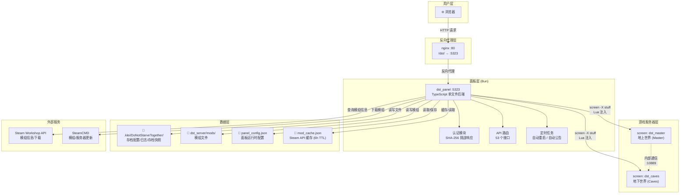

---

## 五、认证流程

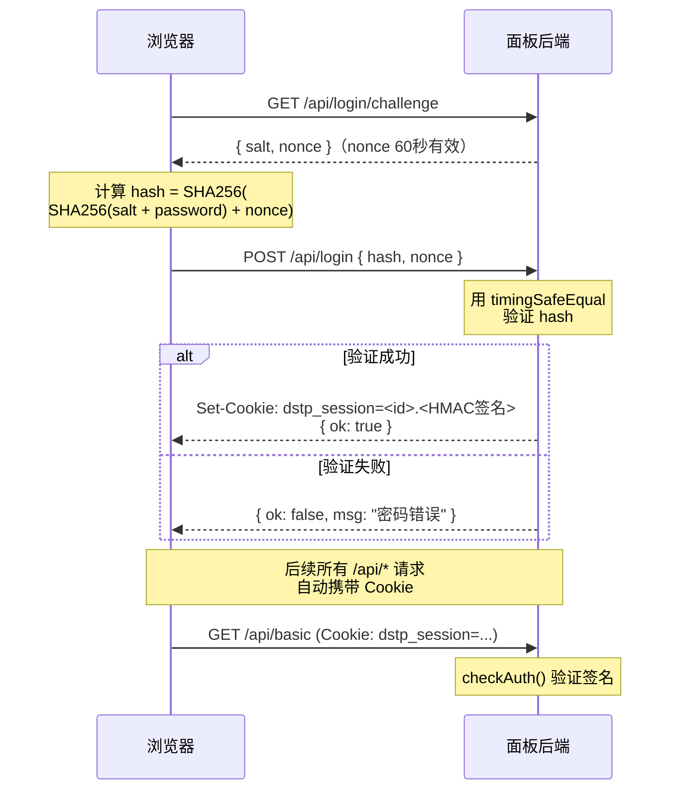

---

## 六、API 路由结构

```mermaid
flowchart LR
    subgraph 认证["认证"]
        L1["GET /login/challenge"]
        L2["POST /login"]
        L3["POST /logout"]
    end

    subgraph 基本设置["基本设置"]
        B1["GET/POST /basic<br/>存档配置/令牌/路径"]
        B2["POST /cluster<br/>切换存档"]
        B3["POST /cluster/rename<br/>重命名存档"]
        B4["POST /cluster/create<br/>新建存档"]
        B5["POST /cluster/delete<br/>删除存档"]
    end

    subgraph 世界编辑["世界编辑"]
        W1["GET /worlds<br/>分片列表"]
        W2["POST /worlds/add<br/>添加分片"]
        W3["POST /worlds/delete<br/>删除分片"]
        W4["GET/POST /world/overrides<br/>世界生成设置"]
        W5["GET /world/modworldgen<br/>模组世界设置"]
    end

    subgraph 模组管理["模组管理"]
        M1["GET /mods<br/>模组列表"]
        M2["GET /mods/detail<br/>模组详情"]
        M3["POST /mods/save-enabled<br/>启用/禁用"]
        M4["POST /mods/config<br/>保存配置"]
        M5["POST /mods/add<br/>注册模组"]
        M6["POST /mods/delete<br/>取消订阅"]
        M7["GET /mods/search<br/>搜索创意工坊"]
        M8["POST /mods/download<br/>下载模组"]
    end

    subgraph 服务器控制["服务器控制"]
        S1["GET /server/status<br/>运行状态"]
        S2["POST /server/start<br/>启动"]
        S3["POST /server/stop<br/>停止"]
        S4["POST /server/restart<br/>重启"]
        S5["POST /server/pause<br/>暂停/恢复"]
        S6["GET/POST /server/adminlist<br/>管理员列表"]
        S7["GET/POST /server/blocklist<br/>黑名单"]
    end

    subgraph 控制台["控制台"]
        C1["POST /console/exec<br/>执行Lua"]
        C2["POST /console/players<br/>在线玩家"]
        C3["POST /console/worldinfo<br/>世界信息"]
        C4["GET /items<br/>物品表"]
        C5["GET/POST /item-history<br/>物品使用历史"]
        C6["GET /saves/list<br/>存档快照"]
        C7["POST /saves/rollback<br/>回档"]
    end

    subgraph 日志["日志"]
        LG1["GET /serverlog<br/>服务器日志"]
        LG2["GET /chatlog<br/>聊天日志"]
        LG3["GET /playerlog<br/>玩家记录"]
        LG4["GET /logs/list<br/>日志文件列表"]
    end
```

---

## 七、服务器启动流程

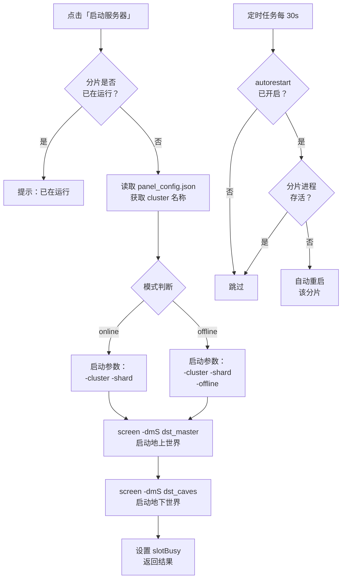

---

## 八、模组下载流程

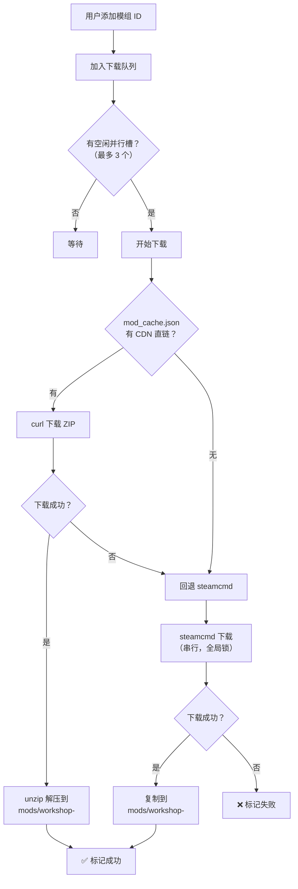

---

## 九、控制台命令执行流程

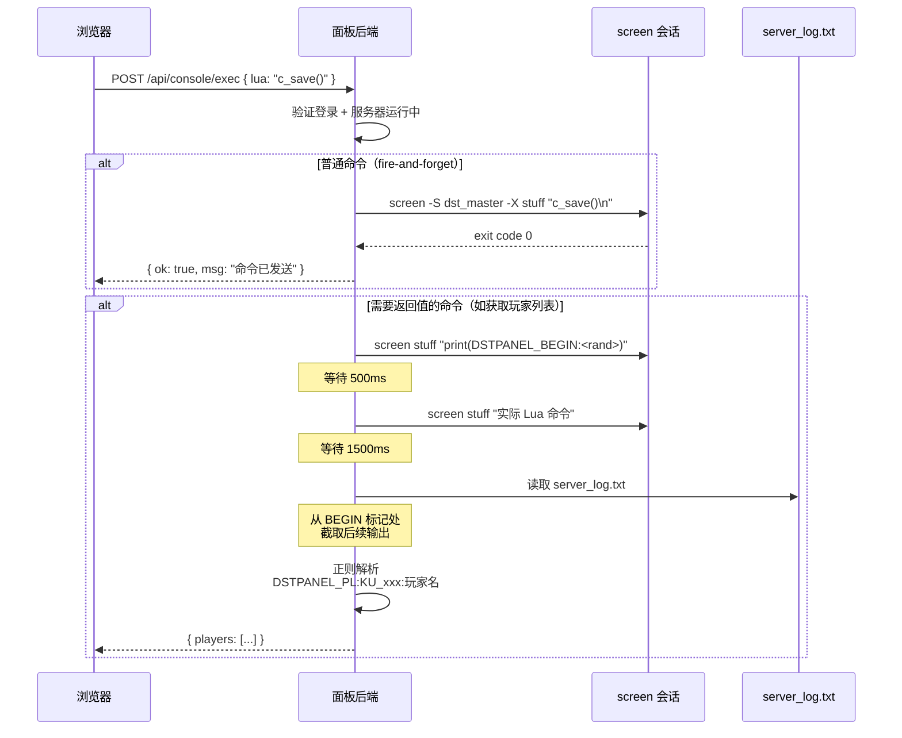

---

## 十、文件 ER 图（实体关系）

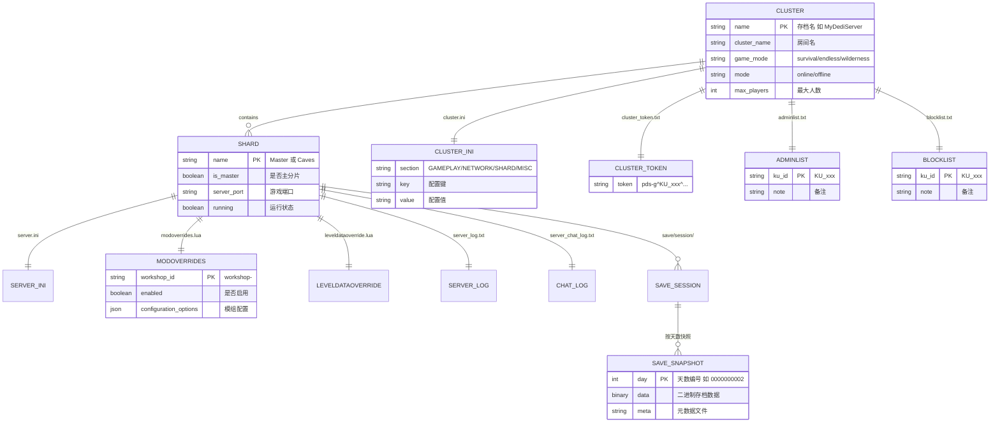

---

## 十一、面板配置文件 ER 图

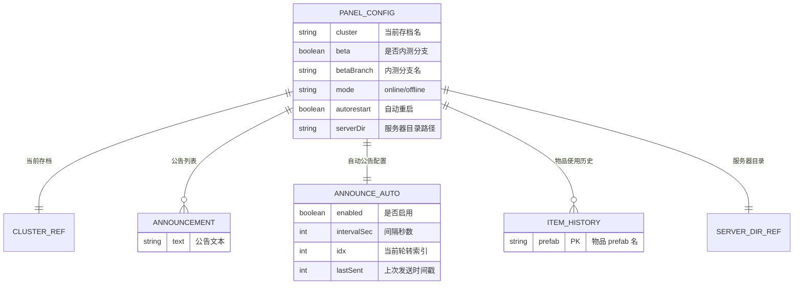

---

## 十二、模组管理架构

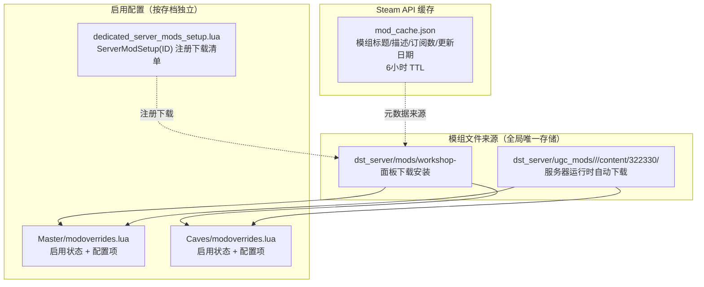

---

## 十三、端口映射

| 端口 | 协议 | 用途 | 公网开放 |
|------|------|------|----------|
| 11000 | UDP+TCP | 地上世界游戏端口 | ✅ |
| 11001 | UDP+TCP | 地下世界游戏端口 | ✅ |
| 27018 | UDP | 地上 Steam Master | ✅ |
| 27019 | UDP | 地下 Steam Master | ✅ |
| 8768 | UDP | 地上 Steam 认证 | ✅ |
| 8769 | UDP | 地下 Steam 认证 | ✅ |
| 10889 | TCP | 分片间通信（Master↔Caves） | ❌ 仅回环 |
| 5323 | TCP | 面板 (Bun) | ❌ 仅回环 |
| 80 | TCP | nginx（面板反代 + SteamCMD 代理） | ✅ |

---

## 十四、源码文件结构

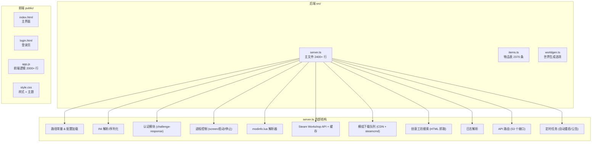

---

## 十五、定时任务流程

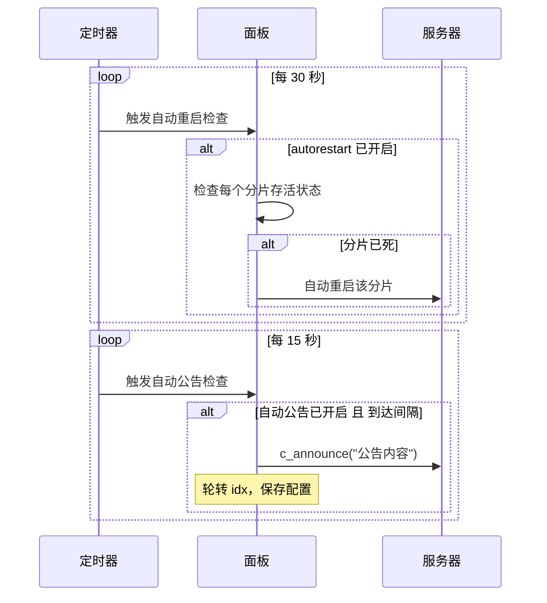

---

## 十六、用户操作流程（页面导航）

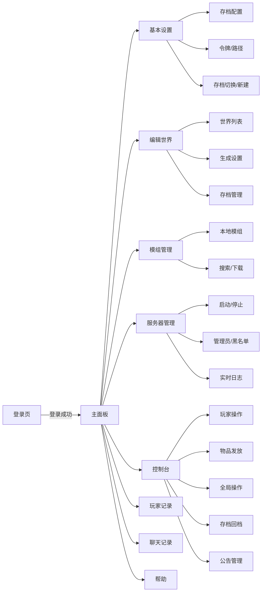

---

## 参考资料

- [Mermaid 流程图语法（一）](https://blog.csdn.net/qq_45324272/article/details/159680814)
- [Mermaid 高级语法（二）](https://blog.csdn.net/qq_45324272/article/details/159682198)
- [Mermaid 官方文档](https://mermaid.js.org/)
- [Mermaid 在线编辑器](https://mermaid.live/)
